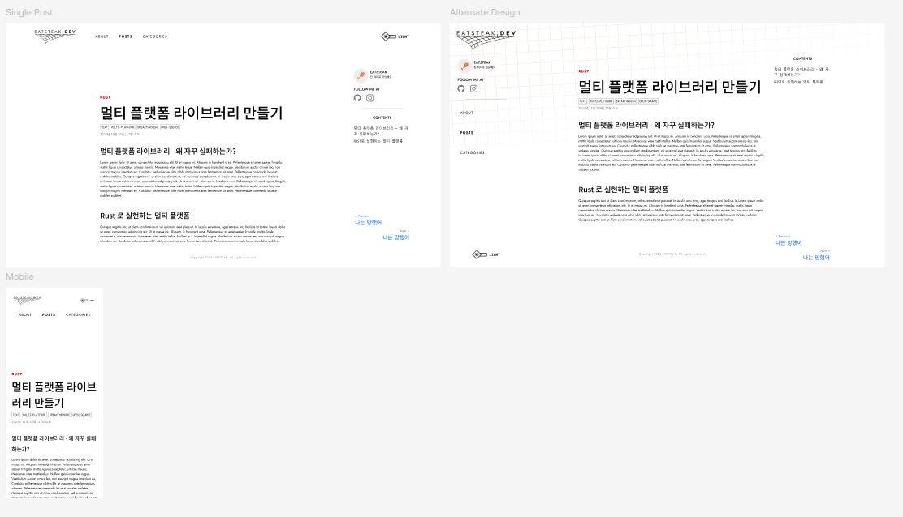
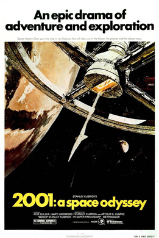
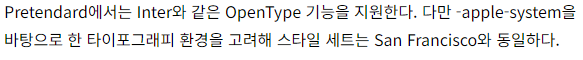
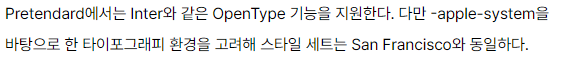
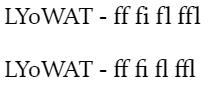

**[앞의 글](/post/constructing-blog)에서 어떤 기술 스택으로 블로그를 만들지 결정했으니, 이젠 어떤 모습의 블로그를 만들지 결정해야 합니다. 사실 제 닉네임이 EATSTEAK(스테이크 먹기)인
만큼 블로그 컨셉을 생각하기는 쉬웠는데요. 하지만 모든 디자인이 예쁘기만 하다고 다 되는 것이 아니듯, 단순한 UI나 컨셉 뿐만 아니라 블로그 본연의 역할에 충실하도록 여러 고려를 하고자 노력했습니다.**

## 디자인 컨셉: 불판

처음에 제 블로그에 대한 구상을 시작했을 때, 제 활동명이 고기인 만큼 고기를 굽는 불판을 모티브로 디자인하고자 노력했습니다. 그 모티브를 바탕으로 Figma를 통해 간단한 목업을 구상했고, 이를 가지고 실제 블로그
웹 사이트를 퍼블리싱하였습니다.



> _최초로 피그마에서 완성한 프로토타입입니다. 두가지 시안 중 고민하다 현재의 디자인으로 결정했습니다._

처음에 잡은 *불판*이라는 컨셉이 프로그램하고는 잘 연결되지 않는 편이라, 불판(정확히는 석쇠)의 형태를 가져와 격자와 각진 이미지의 UI 엘리먼트를 디자인했습니다.

개인적으로 조금 더 모티브를 활용해 디자인하였다면 좋지 않을까 싶은데, 당장은 큰 아이디어가 떠오르지 않네요.

## 서체 선택

이 블로그에서는 세가지 서체를 사용합니다. 라틴 제목용 글꼴인 [Jost](https://fonts.google.com/specimen/Jost)와, 본문용
글꼴인 [Noto Sans KR(Korean)](https://fonts.google.com/noto/specimen/Noto+Sans+KR), 그리고 고정폭, 일부 UI 엘리먼트에 사용되는
글꼴인 [Monoplex KR](https://github.com/y-kim/monoplex)입니다.

### 모던함을 더한 Jost

`Jost` 서체는 1920년대 독일에서 만들어진 [Futura](<https://en.wikipedia.org/wiki/Futura_(typeface)>)에 영감을 받아 만들어진 서체입니다. 영화감독 스탠리 큐브릭이
자주 사용했기로 유명하기도 하고, 모던함의 시초가 되는 Typeface인데, 앞서 말한 불판과 프로그래밍의 연결 고리가 약하단 점을 좀 더 모던한 이미지를 통해 보강하기 위해 선택했습니다. 제가 큐브릭 영화들을
좋아하는 것도 조금은 있고요.



> 스탠리 큐브릭 감독의 1968년작 영화 _2001: A Space Odyssey_ 의 메인 포스터에 사용된 Futura
> 서체. <sup>[출처](<https://en.wikipedia.org/wiki/File:2001_A_Space_Odyssey_(1968).png>)</sup>

다만 Jost 서체의 형태가 대문자 `J`가 소문자처럼 디센더로 디자인되어 있거나, 너무 높은 weight에 가면 `V`와 같은 예리한 각도의 글자체들이 너무 날카롭게 디자인되어 있다 보니 베이스라인이 정렬되어 있지
않아 보이는 경우가 있습니다. 그래서 제목용 서체나 디자인적인 요소에만 주로 이 서체를 이용하고, 가독성이 요구되는(글 본문 혹은 글자가 주 정보 전달원인 UI 요소) 요소의 경우 다른 서체를 이용하고자 했습니다.

### 국밥같은 Noto Sans

본문 서체로 선택한 `Noto Sans KR`은 굳이 채용한 이유를 묻지 않아도 알 것입니다. 다만 _왜 않 Pretendard임?_ 라고 묻는 사람이 있을 것 같아서, 이에 대한 부연을 조금 하고자 합니다.



> _16px 기준 `Noto Sans KR`로 본 예시 문장._



> _16px 기준 `Pretendard`로 본 예시 문장._ 어떤 폰트가 더 읽기 편해 보이는가요?

조금 뒤에서도 설명하겠지만, 보통 웹페이지의 내용을 읽을 때 좋은 크기인 16px 기준으로 두 폰트의 예시 문장([Pretendard 소개 웹사이트](https://cactus.tistory.com/306)에서
발췌)을 비교해 보았을 때, 개인적인 느낌으로는 Pretendard보다는 Noto Sans KR이 읽기 측면에서 조금 더 낫다고 판단했습니다.

Pretendard의 경우 전체적인 글리프의 균일성을 중시한다고 생각합니다. 자간과 글리프 크기도 Noto Sans KR에 비해 좁고 작게 설정되어 있으니까요.

> 본고딕의 한글 크기가 대부분의 한글 글꼴들과 비슷하게 다국어 타이포그래피 환경에서는 조금 크게 자리잡아 라틴 글자와 섞어쓸 때 글자 비율을 어느정도 조정해서 쓰는 점이 제품을 만드는 데 어느정도 부채가 쌓이는
> 상황이라 보았고, 이처럼 적합하지 않은 글꼴로부터 생기는 추가적인 소요를 줄이자는 데에서 이 프로젝트를 2020년 11월부터 천천히 다듬어왔다.
>
> - [Pretendard 소개](https://cactus.tistory.com/306)에서.

그러다 보니 Pretendard는 UI 측면에서는 꽤나 훌륭한 글꼴이지만, 균일된 글리프 크기가 읽기 중심의 블로그에는 답답한 느낌이 계속 들었습니다.

그래서 개인적으로는 가독성을 위한 선택이라면 _Noto가 맞지 않나?_ 라는 생각이 들었고, 최종적으로 Pretendard 대신 Noto Sans KR을 선택한 것입니다.

### 포인트 서체, Monoplex KR

`Monoplex KR` 서체는 `IBM Plex Sans KR`의 한글 글리프에 `IBM Plex Mono`의 고정폭 라틴 글리프를 조합하고 조정한 오픈 소스 폰트입니다. 제가 코딩할 때 주로 애용하는 폰트인
만큼, 제 블로그에도 적용하기로 했습니다(_코딩할 때 어떤 고정폭 폰트가 좋냐_ 라는 논쟁엔 끼지 않겠습니다).

이 폰트는 마치 컬러 시스템의 액센트 컬러처럼 UI 엘리먼트 사이의 차별점을 주고, 텍스트 위주의 엘리먼트(토픽 태그, 다크 모드 스위치 라벨 등)에 주로 사용함으로써 포인트 서체처럼 활용하고자 했습니다. 물론 코드
블록에서도 고정폭 글꼴로써 본래 역할을 하기도 합니다.

## 로고 디자인


> _블로그 로고입니다. 왼쪽 상단에서 항상 볼 수 있습니다._

로고는 앞서 말한 석쇠를 형상화하고, 블로그 주소(eatsteak.dev)를 같이 담았습니다. 글자가 마치 불판 위에 떠있는 느낌을 주려고 했는데, 잘 되었는지 모르겠네요.

## 가독성을 위한 타이포그라피

블로그는 내가 쓴 글을 읽게 만들기 위한 사이트입니다. 따라서 잘 읽히는 것이 무엇보다 중요합니다.
가독성을 위해서는 타이포그라피부터 레이아웃까지 사소하지만 신경써야 할 것들이 있습니다.

웹 디자인에서 글꼴과 문단 배치는 가장 기본적인 것이면서도 중요한 것입니다. 몇줄의 CSS만 있으면 쉽게 글의 가독성을 향상시킬 수 있습니다.

```css
* {
  /* 글꼴 크기 및 줄 간격 설정 */
  font-size: clamp(1rem, 0.768rem + 0.893vw, 1.125rem);
  line-height: clamp(1.4, 0.75 + 2.5vw, 1.75);
  /* 문장 길이를 위한 최대 길이 설정 */
  max-width: 75ch;

  /* 합자 */
  text-rendering: optimizeLegibility;

  /* 폰트 안티엘리어싱 */
  -webkit-font-smoothing: antialiased;
  -moz-osx-font-smoothing: grayscale;

  /* (한국어)단어 줄 넘김 방지 */
  word-break: keep-all;
}
```

### 글꼴 크기와 줄 간격: `font-size`와 `line-height`

글꼴 크기는 가독성의 가장 중요한 요소 중 하나입니다. 브라우저의 기본 글꼴 크기는 `16px`인데요. 일반적으로 16px는 데스크톱 환경에서 읽기에 권장되는 글꼴 크기의 마지노선으로 여겨지고 있습니다.[^1]

[^1]:
    [PimpMyType, What's the right font size in web design?, 21. Sep 2021](https://pimpmytype.com/font-size/) 등 다양한
    사이트, 논문에서 적어도 16px 이상을 데스크톱 웹 사이트의 폰트 크기로 하기를 권장합니다.

대부분의 읽기 중심 사이트에서는 16-20px 범위 내에서 글꼴 크기를 크게 설정하는 것을 권장하고 있고,[^2] 뿐만 아니라 글꼴의 종류, 기기에 따라 적절히 읽기 편한 크기를 설정하는 것이 좋습니다.

[^2]:
    각주 [^1]의 웹사이트는
    물론이고, [Luz Rello, Martin Pielot and Mari-Carmen Marcos, Make It Big! The Effect of Font Size and Line Spacing on Online Readability, 2016](https://pielot.org/pubs/Rello2016-Fontsize.pdf)
    와 같은 논문에서도 18px를 가장 적절한 폰트 크기로 권장하고 있고, 20px 이상에서는 큰 효과가 없었다고 서술하고 있습니다.

또한 줄 간격(`line-height`)는 데스크톱 기준 `1.5`에서 `2`사이의 간격을 설정하여(모바일에서는 `1.3`에서 `1.5` 정도가 적당합니다) 너무 간격이 넓어 글이 눈에 잘 들어오지 않도록 하거나,
너무 좁아 답답해 보이지 않도록 하는 것이 좋습니다.

사실 이 글꼴 크기와 줄 간격만 잘 설정하면 가독성을 위한 대부분의 작업은 끝났다고 생각하면 됩니다. 다시 말하면 그만큼 가독성에 중요한 설정이라는 뜻이죠.

### `clamp()`: 동적 글꼴 크기를 위한 함수

그렇다면 디스플레이 크기에 맞추어 최적의 글꼴 크기를 설정하려면 어떤 방법을 사용해야 할까요? 대부분의 CSS 개발자라면 미디어 쿼리를 활용하여 breakpoint를 잡고, 이에 맞추어 크기를 변경하는 방법을 생각할
겁니다. 저도 이전 웹 개발 프로젝트에서 그래왔고요.

하지만 최근의(2020년대) CSS에서는 이보다 더 현대적인 기능을 제공합니다. `clamp()` 함수와 뷰포트에 맞춘 단위들을 활용하면 화면 크기에 맞춰 글자 크기를 동적으로 조정할 수 있습니다.

```css
/* 미디어 쿼리를 활용하여 폰트 크기 조정하기 */
@media screen and (min-width: 768px) {
  :root {
    font-size: 1.125rem;
  }
}
```

기존 방식을 활용하면 쉽게 크기를 설정할 수 있지만, 다양한 크기엔 쉽게 대응하지 못합니다(만약 767px의 화면이라면..?).

```css
/* clamp()를 활용하여 동적으로 글자 크기 조정하기 */
.content {
  font-size: clamp(1rem, 0.768rem + 0.893vw, 1.125rem);
  line-height: clamp(1.4, 0.75 + 2.5vw, 1.75);
}
```

`rem`값과 뷰포트 가로 길이 단위인 `vw`값을 활용하고, `clamp()` 함수를 이용해 최소값과 최대값을 정하면 개발자(혹은 디자이너)가 의도한 범위 내에서 동적으로 글자 크기를 조정할 수 있습니다.

하지만 원하는 범위를 적절하게 설정하기 어려울 수 있습니다. 이를 위해서 [fluid.style](https://fluid.style)과 같은 `clamp()` 값을 자동으로 정의해주는 사이트가 존재하니 이를
활용한다면 편리하게 동적으로 글자 크기를 조정할 수 있습니다.

이 블로그의 경우 글 본문의 경우에만 동적 크기 조정을 적용했습니다. UI 엘리먼트의 경우 읽어야 할 텍스트 양이 많지 않기도 하고, 블로그 레이아웃이 뷰포트에 따라 변하는 것을 원치 않았기 때문입니다.

> `clamp()` 함수는 2020년 6월 이후로 모든 주요 브라우저에서 구현되어 있습니다.

### 글자 크기 설정 시 주의사항

이렇게 글자 크기를 설정할 때 주의해야 할 사항이 몇가지 있습니다. 놓치기 쉽다 보니 간단하게 정리해 봅시다.

#### 최상위 요소에 고정 단위 크기 설정 하지 않기

```css
:root {
  font-size: 18px; /* [!code --] */
  font-size: 1.125rem; /* [!code ++] */
}
```

앞서 말한 적절한 글자 크기를 설정하기 위해서 최상위 요소(`:root`, `html`, `body`)에 고정 단위(`px`, `pt` 등)을 설정하게 되면 브라우저의 글자 크기 설정을 무시하게 되므로 큰 글자
크기가 필요한 사람들에게 적절한 크기로 글자가 표시되지 않게 됩니다.
따라서 글자 크기를 조정하고 싶다면 `1rem` = `16px`라고 가정한 다음 이에 맞추어 `rem`이나 `em`과 같은 단위를 이용하여 글자 크기를 조정하는 것이 좋습니다.

#### 입력이 필요한 요소의 글자 크기는 `16px` 이상으로

사소하지만 놀라운 사실인데, 만약 입력이 필요한 요소(`input`, `textarea` 등)의 글자 크기가 `16px` 미만이라면 iOS 사파리에서는 자동으로 입력 요소를 확대하게 됩니다.[^3] 이렇게 되면
사용자 경험을 크게 해치므로 적어도 `16px` 이상이 되도록 설정하는 것이 좋습니다.

> 물론 강제로 확대를 막을 수 있지만, 그냥 글자 크기를 크게 하는 것이 좋습니다. 방법이 궁금하다면 각주[^3]를 참조하세요.

[^3]: [Rick Strahl, Preventing iOS Textbox Auto Zooming and ViewPort Sizing, 17. Apr 2023](https://weblog.west-wind.com/posts/2023/Apr/17/Preventing-iOS-Safari-Textbox-Zooming)

#### 글자 크기에 맞추어 요소 크기 조정하기

앞선 문단에서 글자 크기가 사용자 마음대로 조정 가능하다고 언급했습니다. 이는 만약 여러분이 고정 단위를 이용해서 글이 담긴 요소의 레이아웃을 정의한다면, 사용자가 글자 크기를 변경하면 모든 페이지 레이아웃이
깨진다는 것을 의미합니다.

따라서 `rem`이나 `em`과 같은 단위를 이용해서 글자 크기에 상대적으로 레이아웃 요소 크기를 지정하여 레이아웃이 깨지는 것을 막아줍시다.

```css
.w-80 {
  width: 20rem; /* 320px */
}
```

> 실제로 `TailwindCSS`와 같은 UI 프레임워크에서도 화면 크기와 관련된 단위를 제외하고는 모두 `rem` 단위를 사용함을 알 수 있습니다.

### 커닝 및 합자: optimizeLegibility

[`text-rendering`](https://developer.mozilla.org/en-US/docs/Web/CSS/text-rendering) 옵션은 꽤나 생소하실 수도 있습니다. 본래는 SVG 렌더링 중
텍스트 렌더링 방법을 결정하기 위한 옵션이지만, Gecko와 WebKit 기반 브라우저는 이를 HTML 렌더링에도 사용할 수 있습니다.

`text-rendering` 옵션을 `optimizeLegibility`로 설정하면 20px 이하의 글자에서 커닝과 일부 합자를 사용하여 렌더링합니다. 이렇게만 이야기하면 이해되지 않을 것 같은데, 어떤 차이가
있는지 살펴보겠습니다.



> _optimizeLegibility 활성화 여부에 따른 차이(위: 비활성화, 아래: 활성화)_

위 예시에서 LYoWAT 부분이 텍스트 커닝을 확인할 수 있는 부분이고, 오른쪽의 ff fi fl ffl 부분이 합자를 확인할 수 있는 부분입니다.

> 커닝(kerning)은 글자의 모양 때문에 활자가 고르게 배열되지 않은 것처럼 보이는 것을 글자 모양에 따라 적당한 간격을 두게 조정하여 시각적으로 매끄럽게 보이게 하는 것을 말한다.
>
> - 한국어 위키백과, [커닝](https://ko.wikipedia.org/wiki/커닝) 문서에서.

잘 확인해 보면 LY나 WAT 사이의 간격이 조절되어 텍스트 자간이 일정해 보이는 효과가 있습니다.

> 합자(合字, ligature)는 인쇄하는 타이포그래피와 손으로 쓰는 필기에서 두 개 이상의 문자가 합쳐져서 하나의 글자 모양(글리프의 형태)으로 형성하는 것을 말한다.
>
> - 한국어 위키백과, [합자](https://ko.wikipedia.org/wiki/합자) 문서에서.

문자가 합자되어 ff의 가로 선 사이의 빈 공간이 없는 것을 확인할 수 있습니다.

이렇게 영문자에 대해 합자를 활성화하면 문장이 더욱 안정적이게 보이는 작은 효과를 얻을 수 있습니다.

### 안티엘리어싱

안티엘리어싱은 폰트에 스무딩을 적용하여 모니터에 폰트가 더욱 자연스럽게 표시되도록 합니다. 안티엘리어싱의 경우 많은 곳에서 다루고 있으므로 길게 얘기하지 않도록 하겠습니다.

대부분의 브라우저에서 안티엘리어싱이 활성화 되어 있으나, 일부 기본적으로 활성화되지 않은 경우를 위해서 CSS를 통해 안티엘리어싱을 활성화 해주었습니다.

### 단어 줄 넘김 방지: word-break

CJK 문장에서는 브라우저가 기본적으로 한 글자 단위로 줄넘김을 수행합니다. 왜인지는 생각해 보면 간단한데, 바로 동아시아 문화권에서는 한국을 제외하면 띄어쓰기를 거의 사용하지 않기 때문입니다. 따라서 기본 옵션을
두고 글을 쓰게 되면 줄넘김이 깔끔하지 않습니다.

<blockquote>
  <p style="word-break: normal;">
  word-break: normal; 인 문장입니다.
  키스의 고유 조건은 입술끼리 만나야 하고 특별한 기술은 필요치 않다. 
  </p>
</blockquote>

<blockquote>
  <p style="word-break: keep-all;">
  word-break: keep-all; 인 문장입니다.
  키스의 고유 조건은 입술끼리 만나야 하고 특별한 기술은 필요치 않다. 
  </p>
</blockquote>

예시와 같이 가독성 향상을 위해서는 `word-break: keep-all;`을 사용하는 것이 좋습니다.

## 다음 글: 블로그 썸네일 자동 생성하기

우리가 링크를 다른 곳에 공유할 때, 해당 웹사이트에서 제공하는 썸네일이 표시되는 경우가 있습니다(GitHub가 대표적이죠). 이런 카드를 표시한 방법을 알아보겠습니다(작성 중입니다).
