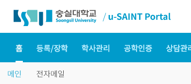
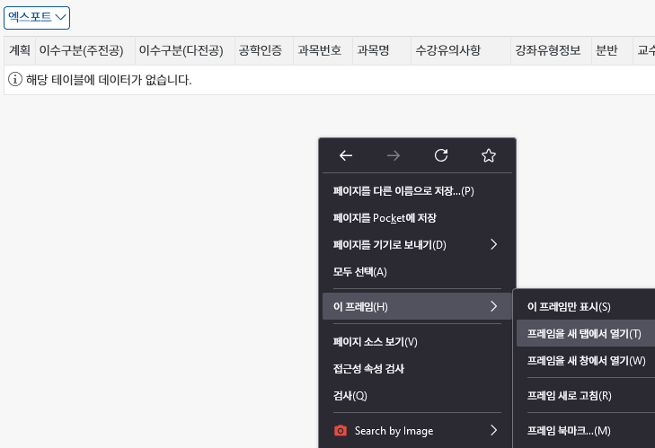

**숭실대 u-saint 학사 시스템은 SAP에서 제작한 솔루션을 사용하고 있습니다. u-saint가 가진 불편함 때문에 많은 학생들이 이를 쉽게 열람하기 위해
파싱하고자 하였고, 최근 들어 [SSUrade](https://github.com/nnnlog/ssurade)
나 [숨쉴때 성적표](https://apps.apple.com/kr/app/%EC%88%A8%EC%89%B4%EB%95%8C-%EC%84%B1%EC%A0%81%ED%91%9C/id1601044486) 등 그 결과물이
학생들에게 실제로 도움이 되는 형태로 나타나고 있습니다.**

**이 시리즈에선 [rusaint](https://github.com/eatsteak/rusaint)를 개발하며 u-saint 구조를 알아낸 과정을 공유하고자 합니다. 이를
토대로 앞으로 많은 학우들이 숭실대 학교 생활에 필요한 서비스를 만들어내길 기대하겠습니다.**

## u-saint 페이지의 실체 알아내기

숭실대학교 [u-saint](https://saint.ssu.ac.kr) 페이지는 어떤 웹 페이지일까요? 뭐가 되었든 굉장히 불편하다는 점은 확실합니다. 테이블 내의 스크롤바와 외부 스크롤바가 동시에 생긴다거나,
반응형처럼 보이지만 반응형이 아닌 페이지라던가요. 페이지 URL이 `saint.ssu.ac.kr/irj/portal`으로 고정되어 있는 것도 묘하게 화나게 만듭니다.

### u-saint는 u-saint가 아니다

u-saint의 주소인 `saint.ssu.ac.kr`은 실제 u-saint 애플리케이션이 서빙되는 주소가 아닙니다. 모든
애플리케이션의 뷰는 `ecc.ssu.ac.kr:8443` 주소 아래에서 서빙됩니다. 실제 `saint.ssu.ac.kr` 주소의 경우 네비게이션 바와 `<iframe>`만 제공하는 셈이죠.

> 여기까지가 `saint.ssu.ac.kr`의 영역입니다.

따라서 각 페이지(강의시간표, 성적조회 등등...)은 바로 그 해당 앱만 표시되는 실제 주소가 있습니다.

> Firefox에서 페이지를 `Shift+우클릭` 후 `이 프레임` > `프레임을 새 탭에서 열기` 메뉴를 클릭하면 원본 페이지를 쉽게 볼 수 있습니다(Chromium 계열에서는 직접 개발자 도구를 열어서
> 찾으세요!).

그러면 우리는 `ecc.ssu.ac.kr:8443/sap/bc/webdynpro/SAP/...`으로 시작하는 주소에 입장하게 됩니다. 여기서 모든 것이 시작됩니다!

> [!NOTE] 500 Internal Server Error가 표시된다면
> 500 에러로 접속이 안될 경우 path 끝 세미콜론 뒤를 지워보세요. 외부 iframe 과 소통하기 위한 파라메터일 수 있습니다.

> [!TIP] 팁
> 호스트 뒤 `:8443`을 빼도 접속됩니다.

### URL에 담긴 정보

애플리케이션의 실제 URL을 알게 되는 것만으로도 우리는 많은 정보를 얻을 수 있습니다. 한번 살펴봅시다.

강의시간표 페이지의 URL은 `https://ecc.ssu.ac.kr/sap/bc/webdynpro/SAP/ZCMW2100` 입니다.
비슷하게 학생 성적 조회 페이지는 `https://ecc.ssu.ac.kr/sap/bc/webdynpro/SAP/ZCMB3W0017`이죠. 우리는 여기서 path의 가장 마지막 부분이 애플리케이션의 고유 ID임을 알
수 있습니다.

그리고 URL에 반복되는 `sap`나 `webdynpro` 같은 키워드를 통해 검색을 좀
해보면 [SAP WebDynpro](https://help.sap.com/doc/saphelp_scm700_ehp02/7.0.2/en-US/a6/41b6a207c7427582c480c654c2e3f7/content.htm?no_cache=true)
는 [SAP](https://en.wikipedia.org/wiki/SAP)의 ABAP 프로그램을 웹에 전시하는 프레임워크의 일종임을 알 수 있습니다.

## SAP WebDynpro를 파해쳐라

앞서 알아낸 URL을 통해 u-saint가 WebDynpro로 만들어진 페이지임을 알 수 있습니다. 이것이 의미하는 바는 바로 u-saint를 스크래핑 한다는 건 WebDynpro 페이지를 스크래핑 한다는 말과
같습니다. 즉, 우리가 해야 할 일은 이제 u-saint 스크래핑이 아닌 WebDynpro 프레임워크로 만들어진 페이지를 스크래핑 하는 겁니다. SAP WebDynpro가 이미 많은 곳에서 사용되는 프레임워크인
만큼, 이 정보를 안다는 사실 만으로 알아낼 수 있는 것들이 많습니다.

## 다음 글

다음 글에서 본격적으로 SAP WebDynpro를 스크래핑하는 데 어떤 어려움이 있는지 알아보고, 초기 u-saint 파싱
라이브러리인 [pysaint](https://github.com/gomjellie/pysaint)를 살펴보며 어떻게 더 접근하여야 문제를 해결할 수 있을지 알아봅시다.