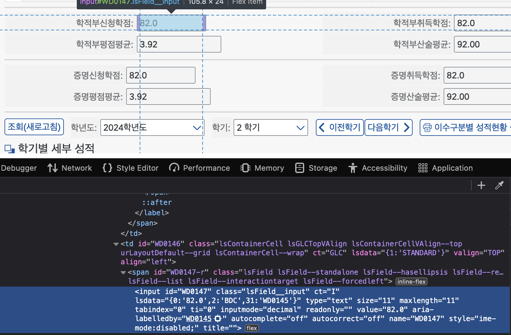
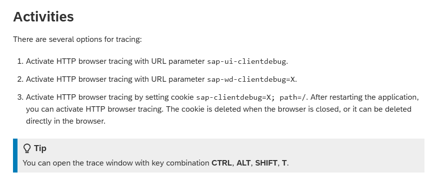
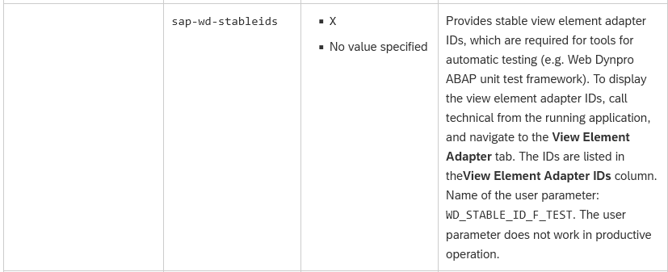
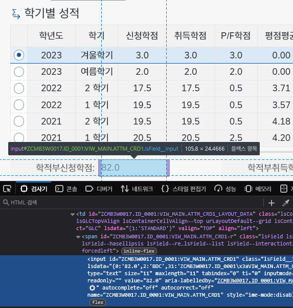

**[u-saint](https://saint.ssu.ac.kr)의 전체적인 구조를 살펴보았으니, 스크래핑을 방해하는 문제를 하나씩 살펴보고, 해결책을 알아보겠습니다. 스크래핑을 방해하는 첫 번째 요소는 바로 동적 ID입니다. 보통 일반적인 웹 사이트의 스크래핑을 할 때 고유하고 고정된 값으로 간주되는 id 어트리뷰트를 많이 이용합니다. 하지만 u-saint에서는 ID가 렌더링 시마다 변화하고, 그 외에는 특정 엘리먼트를 일관적으로 가져오기 어렵습니다. 이 글과 함께 문제를 해결해 봅시다!**

## 문제

u-saint가 사용하는 SAP WebDynpro는 SAP ABAP를 활용해 웹 페이지를 제작할 수 있는 프레임워크입니다. [앞선 글](/post/u-saint-the-hard-parts/)에서 살펴봤듯이 이 프레임워크 때문에 스크래핑이 쉽지 않은 편이죠. 특히 정적 스크래핑을 할 때에는 JS의 도움을 받을 수 없기 때문에 더욱 어렵습니다. [동적 ID 문제](/post/u-saint-the-hard-parts/#문제-2-동적-id)는 정보를 가져오기 어렵게 합니다. 매번 ID가 바뀌니 ID 같은 고정 값이 아닌, [정규식을 이용한 온몸 비틀기](/post/u-saint-the-hard-parts/#해결책-2-동적-id)로 내용을 파싱할 수 밖에 없었는데요. 내용이 바뀌거나 레이아웃이 조금만 바뀌어도(심지어 띄어쓰기 하나만 하더라도!) 정규식 불일치로 인해 파싱에 실패하기 십상입니다.

## 목표

우리의 목표는 _"어떻게 더 안정적으로 파싱할 수 있을까?"_ 입니다. 정규식 몸비틀기와 불안정한 ID에 기대기에는 u-saint가 바뀔 때마다 매번 찾고, 변경하는 고된 작업을 할 수 밖에 없습니다. 결국 모두 고유의 값이 아니고, HTML의 구조와 엘리먼트 내의 텍스트만 읽고 판단하다 보니, 약간의 표현이 바뀌거나 구조가 조금만 바뀌어도 많은 픽스가 필요하죠. 지속 가능한 파싱을 위해서는 엘리먼트의 실제 값과 밀접하게 연관되어 있는 고유의 값을 찾아내는 것이 최선일 겁니다. 과연 그런 방법이 있을까요?

## 알레스카에서 고유값씨 찾기

그렇다면 우리가 관심 있는 정보를 파싱하기 위한 고유값은 어떻게 찾아낼까요? 찾기 위해서 정보가 있는 HTML 요소를 살펴봅시다.


> 여기의 "학적부신청학점:" `label`과 선택되어있는 `input`을 들여다 봅시다.

```html
// [!code word:lsdata=]
// [!code word:id=]
// [!code word:for=]
<td ct="GLC" lsdata="{1:'STANDARD'}" id="WD0143" class="lsContainerCell lsGLCTopVAlign lsContainerCellVAlign--top sapLSGLTop urCellBgFill1 urLayoutDefault--grid lsContainerCell--wrap" valign="TOP" align="left">
  <span id="WD0144-r" class="lsLabel--root">
  <label ct="L" lsdata="{1:'WD0146',3:'학적부신청학점',7:'100\x25',13:'ENDOFLINE',15:true}" id="WD0144" bhastabstop="false" for="WD0146" class="lsLabel lsLabel--valign lsControl--endaligned  lsLabel--standalone lsControl--fullwidth lsLabel--wrapping lsLabel--designbar-colon" title="">
  <span id="WD0144-text" class="lsLabel__text lsLabel__text--overflow" title="">학적부신청학점</span>
  </label>
  </span>
</td>
<td ct="GLC" lsdata="{1:'STANDARD'}" id="WD0145" class="lsContainerCell lsGLCTopVAlign lsContainerCellVAlign--top urLayoutDefault--grid lsContainerCell--wrap" valign="TOP" align="left">
  <span id="WD0146-r" class="lsField lsField--standalone lsField--hasellipsis lsField--readonly lsField--list lsField--interactiontarget lsField--forcedleft">
  <input id="WD0146" ct="I" lsdata="{0:'82.0',2:'BDC',31:'WD0144'}" type="text" size="11" maxlength="11" tabindex="0" ti="0" inputmode="decimal" class="lsField__input" readonly="" value="82.0" aria-labelledby="WD0144" autocomplete="off" autocorrect="off" name="WD0146" style="ime-mode:disabled;" title="">
  </span>
</td>
```
복잡합니다. 그쵸? 그래도 잘 뜯어보면 고유값이 될 수 있을만한 후보는 몇 안되는 것을 알 수 있습니다. 강조된 `lsdata`, `id`와 `for` 속성이죠. `lsdata`는 확인해 보면 `WD0146`, `학적부신청학점` 등 요소의 메타데이터가 포함되어 있음을 추측해 볼 수 있겠고, `id`는 당연하지만 매 렌더에서는 고유하지만 영속적이진 않은 id, `for`는 `label`에서 `id`를 가르키는 속성이죠.

우리가 관심있는 `학적부신청학점`의 값(`82.0`)을 가져오려면 두 가지 방법이 있습니다.

- 원하는 값의 `input`을 가르키는 `label`을 문자열로 찾고(이 경우에는 `학적부신청학점`), `label`의 `for` 속성으로 `input`의 `id`를 구해 값을 가져온다.
- 내부 요소의 구조로 요소를 찾아 값을 가져온다(이 경우에는 `table > tr > td:nth-child(2) > input` 같은 형태가 되겠죠).


두 방법 다 약간의 변경만 있어도(`학적부신청학점`이 `학적부 신청학점`이 된다면? 혹은 테이블 내부 구조가 변경되어 정확하게 그 위치에 있지 않다면?) 데이터를 안정적으로 가져오기 힘듭니다. 그래서 `pysaint`에서는 이런 값들과 고유 속성들의 일부만 정규식으로 검사하는 방법으로 안정성을 높이려고 했습니다(그래도 현재는 잘 동작하지 않음). 정말 유지보수가 간편하고 안정적으로 데이터를 찾는 방법은 없을까요? 놀랍게도 아주 간단한 방법이 있습니다.

## 도메인적 접근

사실 코드로만 안정적으로 파싱을 하긴 어렵습니다. 하지만 모든 순간에서 코드만이 중요하지는 않죠. 생각을 달리 해 봅시다. 처음에 언급했듯이, u-saint는 SAP의 WebDynpro라는 프레임워크로 만들어진 웹 사이트입니다. 이게 뭘 의미할까요? 바로 이 프레임워크로 다른 사이트도 만든다는 것이고, 이를 개발하는 개발자도 있다는 뜻이죠. 그렇다면, **이 개발자들은 사이트를 어떻게 테스트 할까요?**

생각해 보면 이상합니다. 개발자가 사이트를 개발하고, 정해진 시나리오대로 테스트하고자 한다면, 위와 같은 구조는 테스트하기 어렵습니다. 그렇다면 분명 이 프레임워크를 테스트 할 수 있는 툴도 있을 것이고, 이를 우리가 사용할 수 있을지 알아보는 건 한번쯤 시도해 볼 만한 일입니다.

### 독스 찾기

간단하게 `SAP WebDynpro`라는 키워드로 구글에 검색해 보면 [SAP 공식 사이트](https://help.sap.com/docs/ABAP_PLATFORM_NEW/fc79a39b30fe4d9aa983bad6787ab9ad/4e161363b81a20cce10000000a42189c.html)가 나옵니다. 여기서 `Quality Assurance and Supportability` 항목을 봅시다. `Unit Test Framework`등 관련있는 주제를 살펴볼 수 있습니다. 아쉽게도 `Unit Test Framework`는 HTTP 환경에서 실행하는게 아니므로 우리가 활용할 수는 없습니다.



[HTTP Browser Tracing](https://help.sap.com/docs/ABAP_PLATFORM_NEW/fc79a39b30fe4d9aa983bad6787ab9ad/f0113d6dead34df5ab5577e951c14dd0.html)페이지를 보면 재밌는 내용을 발견할 수 있습니다. `sap-wd-clientdebug` URL 파라메터를 사용하면 디버그 창을 띄울 수 있다는 건데요. 아쉽게도 실제로 URL 파라메터를 입력하고 키를 입력해도 디버그 창이 뜨진 않습니다. 하지만 애플리케이션을 제어하는데 URL 파라메터를 사용한다는 사실을 알았습니다.

이 힌트를 토대로 독스를 뒤져보면 [Reference: Application and URL Parameters](https://help.sap.com/docs/ABAP_PLATFORM_NEW/fc79a39b30fe4d9aa983bad6787ab9ad/2b7639d3b822457e86f35dd4c8eea221.html)가 나옵니다. 이 페이지는 WebDynpro 애플리케이션에서 사용할 수 있는 URL 파라메터의 목록을 볼 수 있습니다.


재미있게도 저희가 필요로 하는 파라메터가 바로 나옵니다. `sap-wd-stableids` 파라메터를 사용하면 자동 테스팅을 위해 Stable id가 제공된다네요. 바로 테스트 해 봅시다.


바로 ID가 고정됨을 알 수 있습니다. 형태를 보니 내부에서 사용하는 ID 같네요. 이걸로 간편하게 내부 파싱이 가능하고, 변경되어도 ID만 알면 되니 유지보수도 훨씬 간편해집니다.


> [!NOTE] TL;DR
> 가끔은 코드를 들여다 보는 것 보다 하고자 하는 것의 정보를 찾는 것이 더 빠른 길일 때가 있습니다.
## 다음 주제: 이벤트
이제 u-saint 파싱을 어렵게 하는 것 중 마지막 하나만 남았습니다. 도대체 사용자와의 인터렉션은 어떻게 처리하는 걸까요? HTTP 요청과 응답을 살펴보면서 확인해 봅시다.
