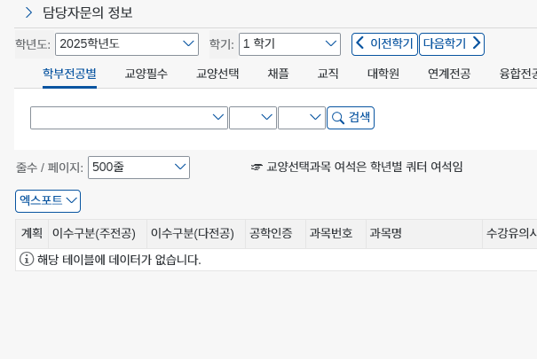
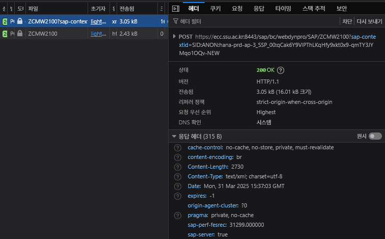

**이제 u-saint의 특정 부분만 확실하게 가져올 수 있는 `sap-wd-stableids`를 알아냈습니다. 그렇다면 이제 원하는 정보를 입력하려면 어떻게 해야 할까요? WebDynpro에서 이벤트를 처리하는 방법을 알아보고, 이를 해석 & 모방해 봅시다.**

## 눈만 달렸지, 팔다리는 없는

[앞선 글](/post/u-saint-events/)에서는 `sap-wd-stableids`를 통해 내가 원하는 위치에 있는 요소를 곧바로 가져오는 방법을 알아 봤습니다. 덕분에 u-saint의 내부 정보를 쉽게 가져올 수 있게 되었습니다. 야호!

바로 한번 적용해 봅시다.

> ..?

보여지는 페이지에 접속하고, 여기서 데이터를 가져올 수는 있게 되었지만, 아쉽게도 여러분은 브라우저가 아닌 단순 HTTP 요청만 보내고, HTML을 받아올 수밖에 없다는 점을 잊지 맙시다. 그렇다면 여러분이 이 페이지에서 어떤 일을 할 수 있을까요? 안타깝게도 학년도와 학기 정보 정도밖에 가져올 수 없겠네요.

이제부터가 u-saint 정적 스크래핑의 가장 큰 암초입니다. **과연 버튼을 클릭하면 무슨 일이 일어나고, 이 정보를 어떻게 가져올 수 있을까요?** 이 글이 끝났을 시점에는 정답을 알 수 있겠죠?

## 버튼 뒤에서는 무슨 일이 벌어지는가

그렇다면 우리가 다음으로 해야 할 일은, 브라우저 없이 콤보박스와 버튼을 클릭하는 동작을 모방하는 것입니다. 이렇게 말하니 말도 안되는 일 같기도 합니다. 어떻게 브라우저 없이 콤보박스와 버튼을 클릭할까요? 다시 조금 질문을 바꿔서, 어떻게 실제로 버튼을 클릭하지 않고 서버에 버튼을 누른 것처럼 알릴 수 있을까요? 과연 버튼을 누르면 u-saint 안에서는 어떤 일이 벌어질까요?

### 과거로 돌아가기: `<form>`

기본적으로, 웹은 페이지로 이루어져 있습니다. 아주 오래 전에는 모든 웹 사이트가 _웹 애플리케이션이 아닌,_ 단순 페이지였죠. 여기서 페이지랑 정말 책의 페이지처럼, 문서의 역할이 대부분이였습니다 (단, 하이퍼링크가 달린). 여기서 누군가가 생각합니다: "이 페이지를 보는 사람들의 이야기를 듣고 싶어.". 바로 `<form>`의 등장입니다 (실제 이야기가 이렇게 이루어졌다는 뜻은 아닙니다. 이야기적 허용이라고 생각해 주세요).

`<form>`은 겉으로 보기에 매우 단순합니다. 사용자가 `<input>`에 값을 입력하고, `submit` 버튼을 누르면 내용이 서버에 전송됩니다. 이를 내부에서 보면 `<input>`의 값을 브라우저가 가지고 있다가, `submit` 버튼을 누르면 폼의 `action` 어트리뷰트에 정의된 페이지로 입력 값을 포함한 `POST` 요청을 보내죠. 그럼 서버에서 받은 `POST` 요청을 토대로 어떤 페이지를 보내줄지 결정해서 사용자에게 보냅니다.

이 아주 단순한 동작에서 생각해 봅시다. **"사용자가 버튼을 누르면, 서버에 입력을 포함한 요청을 보내고, 서버는 입력을 토대로 응답을 보낸다."**

### 중요한 것은 요청을 보내는 마음

사용자가 현재 클라이언트에 없는 새로운 정보를 페이지와 상호작용하여 얻으려면, 위의 단계를 무조건 따라야 합니다 (위 이야기는 많이 단순화 된 것은 맞습니다. 옛날 이야기니까요). 그럼 서버에 입장에서 생각해 봤을 때, 가장 중요한 것은 뭘까요? 바로 사용자의 요청입니다. 서버는 사용자가 실제로 버튼을 누르는지, 스크롤을 하는지, 선택을 하는지는 중요하지 않습니다. 결국 서버는 사용자가 보낸 요청만 알 수 있고, 그에 맞는 응답을 보낼 뿐입니다.

이 사실을 토대로, **어떻게 브라우저 없이 버튼을 누를까?** 라는 문제는 **어떻게 서버에게 버튼을 눌렀다는 요청을 보낼 수 있을까?** 라는 문제로 변합니다. 이 사실을 알았다면 다음으로 할 일은 간단합니다. 개발자 도구의 네트워크 창을 열어봅시다. 여기에는 브라우저가 서버에 보내는 모든 요청과 응답이 기록되어 있으니까요.

> 성공한 POST 요청

네트워크 창을 열고, 버튼을 클릭하면 위처럼 클라이언트가 서버에 요청을 보냅니다. 이로 짐작해보면, 클라이언트는 서버에게 내가 한 동작에 따라 입력 값을 보내고, 그 값을 토대로 브라우저에 데이터를 표시할 수 있음을 알 수 있습니다. 이제 이 요청을 동일하게 보내기만 하면, 서버에서 실제 데이터를 표시할 수 있겠죠?