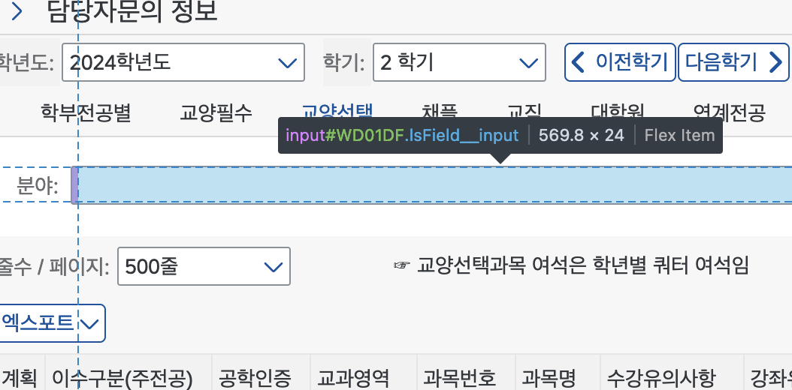
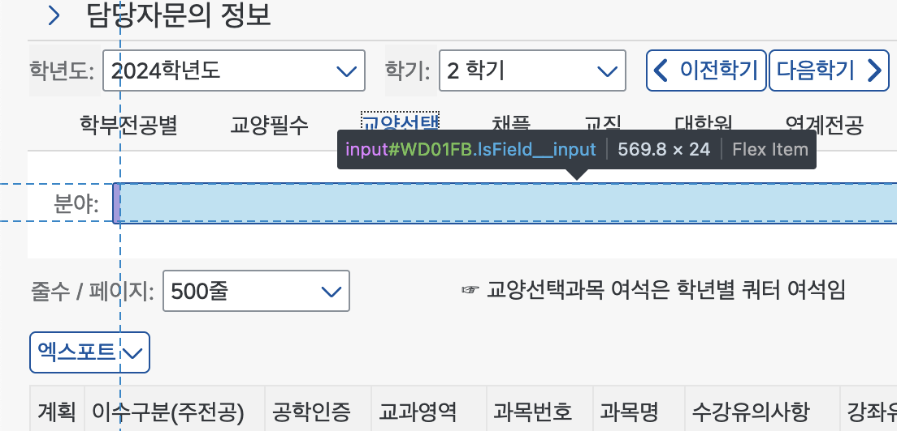
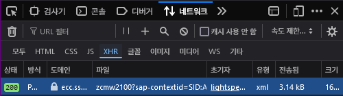
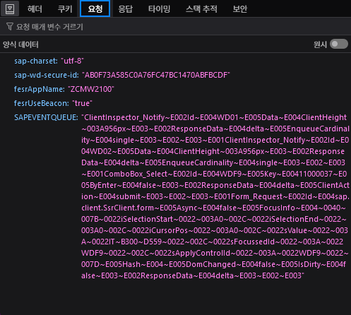
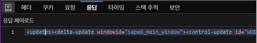
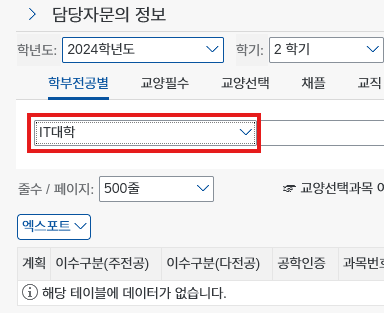

**[앞선 글](/post/examining-ssu-u-saint)에서 u-saint의 간략한 외부 구조와, SAP WebDynpro 프레임워크로 u-saint가 만들어졌다는 점을 알아봤습니다. 그렇다면 일반적인 웹
스크래핑처럼 u-saint도 동일한 방법으로 DOM을 파싱하고 데이터를 가져오면 되지 않을까요? 왜 다양한 라이브러리, 앱들이 나오고 이렇게 글도 쓰는 걸까요? 일반적인 웹 페이지 스크래핑과 u-saint 스크래핑의
차이와, 어떤 부분이 u-saint 스크래핑을 어렵게 하는지 알아봅니다.**

## 웹 스크래핑은 어떻게 하는가?

아마 [jsoup](https://jsoup.org/)이나 [Selenium](https://www.selenium.dev/)을 사용해 보셨다면 아시겠지만 웹 스크래핑은 페이지의 구조만 잘 파악한다면 그렇게 어렵지
않습니다. 일반적인 웹 개발자라면 HTML 노드나, CSS 선택자에 대한 지식이 있을 것이고, CSS 선택자와 DOM API를 활용해 보았다면 이를 이용해 편리하게 스크래핑을 할 수 있죠. `id` 어트리뷰트로 특정
노드에 대한 고유 식별자가 있다면 일은 더 쉬워집니다.

다만 스크래핑에서 어렵다고 여겨지는 부분은 **동작** 인데요. 일반적인 정적 페이지(블로그 포스트 등)이라면 특별한 클라이언트의 조작 없이도 페이지의 모든 정보에 접근할 수 있습니다. 다만 로그인이나, 특정한 버튼
조작이 필요하거나, SPA 등의 자바스크립트의 개입이 많은 페이지의 경우 웹 스크래핑이 힘들어집니다. 당연히 스크래핑이란 사용자의 액션을 모사하여 사용자가 볼 수 있는 데이터를 기계가 수집할 수 있도록 하는 행위인
만큼, 액션의 수가 많아지고 복잡해 질 수록 스크래핑도 어려워지겠죠.

여기서 스크래핑은 두 가지 방법으로 나눕니다. 상대적으로 간단한 페이지(정적 페이지)에 대한 **정적 스크래핑**과 복잡한 사용자 액션이 필요한 페이지에 대한 **동적 스크래핑**이죠.

### 정적 스크래핑

앞서 언급한 [jsoup](https://jsoup.org)가 정적 스크래핑의 좋은 예시라고 할 수 있습니다. 정적 스크래퍼가 하는 일은 간단합니다. HTML 문서를 파싱하여 DOM 트리 형태로 만들고, CSS
선택자나 id 등으로 DOM 내부 요소들을 조작, 파싱할 수 있는 API로 웹 페이지 내부 정보들을 가져올 수 있게 합니다.

이런 정적 스크래퍼들은 웹 브라우저의 동작을 정확히 구현하지 않고, 단순히 HTML 문서만 불러와 분석, 처리하는 것이기 때문에 매우 가볍고 빠르며, 다양한 환경에서 처리할 수 있죠. 다만 앞서 언급한 정적
스크래핑과 동적 스크래핑의 차이로 인해, 복잡한 웹 페이지들은 스크래핑이 어렵습니다(CSR, SPA 등등...).

> [!IMPORTANT] 정적 스크래핑의 장/단점
> **장점**
>
> - 빠르고 간편하다
> - 브라우저가 제공되지 않는 환경(웹 브라우저가 기본 제공되지 않는 환경, 백그라운드 작업 등)에서 사용할 수 있다.
>
> **단점**
>
> - 복잡한 사용자 동작은 처리할 수 없다.
> - CSR, SPA 등의 기술을 사용하거나 모던 프레임워크를 사용하는 페이지는 스크래핑하기 어렵다.

### 동적 스크래핑

정적 스크래핑에 대비해 [Selenium](https://selenium.dev)로 대표되는 동적 스크래핑은 좀 더 정확하고, 복잡한 액션을 수행할 수 있습니다. 동적 스크래핑은 단순히 DOM 구조만 파싱하는 것이 아니라 실제 브라우저를 스크래핑 환경에서 실행하여 브라우저를 조작하는 방식으로 스크래핑이 이루어집니다. 즉, 동적 스크래핑 툴은 HTML을 직접 파싱하는 동작을 한다기 보다는 브라우저를 조작하고 브라우저에서 데이터를 읽는 API를 제공합니다.

이런 동적 스크래핑 툴들은 본래 웹 사이트를 테스트하는 데 주로 쓰입니다. 하지만 브라우저를 자동으로 조작할 수 있다는 점에 착안하여 스크래핑 용도로도 사용됩니다. 실제 브라우저 환경을 그대로 구현하므로 사용자에게 사이트가 어떻게 보일지, 어떻게 동작할지 정확하게 확인할 수 있는 것을 역이용 한 것이죠. 또한 브라우저에서 사용할 수 있는 JS API 등을 그대로 이용할 수 있으므로 웹 개발에 익숙한 개발자라면 이를 활용해서 스크래핑을 더 편리하게 할 수 있습니다.

하지만 브라우저가 직접 구동되어야 하는 만큼 브라우저가 사용하는 리소스+α를 사용하게 되고, 브라우저 런타임에서 모든 HTML, CSS, JS 파싱 및 실행을 하게 되므로 정적 스크래핑에 비해 속도가 느리고, 브라우저 드라이버를 미리 설치해야 하는 등 환경에 제약이 있습니다.

> [!IMPORTANT] 동적 스크래핑의 장/단점
> **장점**
>
> - 브라우저의 모든 동작을 재현할 수 있다.
> - JS API도 활용하여 편하게 스크래핑 할 수 있다.
> - (이론상)모든 형태의 페이지를 스크래핑 할 수 있다.
>
> **단점**
>
> - 브라우저 런타임이 자원+시간을 많이 소모한다.
> - 브라우저를 실행할 수 있는 환경에서만 사용할 수 있다.

스크래핑의 기본을 알아보았으니, 이제 본론으로 들어가 봅시다.

## u-saint 스크래핑의 적

u-saint 를 스크래핑 하고자 하는 사람들의 주 관심사는 아마 시간표 정보, 성적 정보들일 겁니다. 그렇다면 이런 정보를 가져오는 데 정확히 어떤 어려움이 있을까요?

### 정보를 언제 가져와서 사용할 것인가?

보통 스크래핑의 경우 필요한 데이터를 수집하기 위해 사용합니다. [여기어때](https://www.donga.com/news/It/article/all/20230404/118678619/1)의 경우처럼 공개된 데이터를 가져와 저장해 두고 활용하는 경우가 있을 것이고, [초기 뱅크샐러드](https://steemit.com/banksalad/@zard/3hjdcb)의 경우처럼 개인 정보를 수집하여 서비스를 만들 수도 있죠. 조금 더 가까운 예시를 활용하면, [에브리타임](https://everytime.kr)의 시간표 기능은 일반적인 정보를 스크래핑하는 영역이고, [SSUrade](https://github.com/nnnlog/SSUrade)의 경우 개인의 정보를 실시간으로 업데이트 하는 것이 중요합니다.

이 차이에 따라 스크래핑 방법에서 고려해야 할 점이 달라지는데요. 에타 시간표의 경우 어떤 방법이든, 얼마의 시간이 걸리든 데이터를 수집하여 저장해 두면 서비스에 활용하기 쉽습니다(주기적으로 업데이트 해야 하지만요). 하지만 성적 정보의 경우 각 개인마다의 인증이 필요하므로 개인 기기마다 스크래핑을 새로 수행해야 합니다. 그러다 보니 스크래핑 시간에 제한이 생기고(사용자가 요청했을 때부터 스크래핑 해야 하기 때문에 빠르게 정보를 가져오는 것이 중요하죠), 기능에 따라 방법에도 제한이 생길 수 있습니다(iOS같은 모바일 플랫폼에서는 백그라운드에서 할 수 있는 작업을 제한하기도 합니다).

따라서 우리가 관심있는 성적 정보를 가져와 서비스에 활용하기 위해서는 어느 정도의 스크래핑 방법과 시간이 제한될 수 밖에 없음을 이해하면 되겠습니다. 그렇다면 당연히 **정적 스크래핑** 방법으로 스크래핑을 한다면 많은 장점을 얻을 수 있을 겁니다. 하지만 u-saint가 정적 스크래핑이 가능할까요? u-saint의 구조를 살펴보면서 스크래핑 전략을 세워 봅시다.

### 문제 1. 인증

우리가 원하는 정보는 개인마다 다른 **개인 정보**입니다. 이 말인 즉슨 각자의 숭실대 ID로 로그인 한 후 정보를 가져와야 한다는 말이죠. 그러기 위해서는 세션이 필요합니다. 이 부분은 굉장히 쉽습니다. [숭실대 통합로그인](https://smartid.ssu.ac.kr/Symtra_sso/smln.asp) 페이지를 통해 토큰을 얻어오고, [u-saint SSO 엔드포인트](https://saint.ssu.ac.kr/webSSO/sso.jsp)에서 해당 토큰을 넘겨주면 SAP 세션 쿠키를 얻어올 수 있죠. 이 부분은 정적 스크래핑으로도 충분히 할 수 있는 부분입니다.

### 문제 2. 동적 ID

[앞선 문단](#정적-스크래핑)에서 보통 스크래핑을 할 때 HTML 의 `id` 어트리뷰트와 같은 고유 식별자를 기준으로 스크래핑을 많이 수행한다고 이야기했습니다. 하지만 u-saint의 경우 `id` 어트리뷰트가 존재하지만, 매 렌더링때마다 같은 엘리먼트가 같은 `id`를 가짐을 **보장할 수 없습니다.** 즉, `id`가 한 페이지 내에서는 고유하지만, 요청 때마다 고유하지는 않다는 의미입니다. 페이지가 약간 변경되거나, 사용자의 동작 순서가 바뀌기만 해도 같은 엘리먼트의 ID는 바뀔 수 있습니다.




> 같은 엘리먼트임에도 불구하고 ID가 `WD01DF`와 `WD01FB`로 다름을 확인할 수 있습니다.

#### WebDynpro는 ID를 어떻게 결정할까?

그렇다면 이 ID들은 어디서 오고, 어떻게 결정될까요? 그 비밀을 알면 ID로 파싱할 수 있지 않을까요? 안타깝게도 그렇게 쉽지는 않습니다. 각 엘리먼트의 ID는 서버에서 결정되고, 서버에서는 엘리먼트가 생성되는 순서대로 ID를 결정합니다. 즉, 어떤 고유 의미가 존재하는 게 아닌, incremental한 ID라는 의미죠. 따라서 ID를 이용해 엘리먼트를 선택한다면 애플리케이션이 변하지 않는다는 가정 하에는 완전히 동일한 동작을 해야만 동일한 ID로 접근할 수 있음을 알 수 있습니다. 따라서 ID를 이용해 파싱하기란 어렵고, 다른 방법을 이용해야만 합니다.

### 문제 3. 부분 SSR 렌더링

WebDynpro 프레임워크는 기본적으로 SSR 프레임워크입니다. 서버 사이드에서 HTML을 렌더하여, 클라이언트에 전송해 주는 방식이죠. 하지만 사용자 입력을 처리하고 실시간으로 업데이트(AJAX)하기 위해 WebDynpro에서는 부분 렌더링을 사용합니다. 기본 베이스 페이지를 HTML로 내려주고, 클라이언트의 액션이 발생할 때마다 서버에서 변경된 부분의 HTML을 보내주어 클라이언트에서 해당 부분만 교체하는 방식입니다. 이를 담당하는 클라이언트 측 라이브러리가 `Lightspeed` 라이브러리입니다. 클라이언트의 액션을 서버에 전송하고, 서버에서 내려준 HTML을 교체, 렌더링하는 역할을 합니다. 그렇기 때문에 POST 요청을 통해 HTML의 부분을 서버로부터 받아야만 제대로 된 데이터를 읽을 수 있습니다.

이 SSR 렌더링 로직을 파악하는 것이 WebDynpro 페이지 스크래핑의 가장 큰 과제일 것입니다. 동적 스크래핑의 경우 정확한 엘리먼트를 찾아내기만 하면 이외 내용은 사용자의 입력을 모사하기만 하면 되므로 간단해지지만, 앞선 [요구사항](#정보를-언제-가져와서-사용할-것인가?)을 생각한다면 정적 스크래핑을 하는 것이 최선이고, 이러한 로직을 정적으로 구현하는 것은 까다로운 일입니다. 하지만 앞서 설명한 로직에 따르면 서버에서 미리 HTML을 렌더하여 클라이언트에 보내 주므로 정적 스크래핑이 불가능하지는 않습니다! 일련의 업데이트 로직에 JS 코드의 개입이 거의 없기 때문이죠.

> [!NOTE] 정리
>
> 1. 성적 정보 등은 사용자의 요청 이후에 스크래핑을 시작해야 하므로 환경과 시간에 제약이 있다.
> 2. u-saint에 로그인하는 사용자 인증을 구현해야 한다.
> 3. 매번 ID가 바뀌므로 보이는 정보를 통해 엘리먼트를 선택할 수 밖에 없다.
> 4. 자체적인 SSR 로직을 클라이언트에서 구현하는 데 어려움이 있다.

## [pysaint](https://github.com/gomjellie/pysaint)는 어떻게 했을까?

이제 어떤 문제가 u-saint 스크래핑을 어렵게 하는지 알았으니, u-saint 스크래핑을 구현했던 초기 공개 라이브러리인 [pysaint](https://github.com/gomjellie/pysaint)에서 어떤 방식으로 크롤링을 구현했는지 알아봅시다. `pysaint`는 정적 크롤러입니다. Python의 `BeautifulSoup`과 `requests`모듈을 통해 HTML DOM을 파싱하고, GET, POST 요청을 핸들링합니다.

> [!TIP] 파이썬으로 웹 스크래핑
> Python의 경우 웹 스크래핑 생태계가 아주 좋은 편입니다. 보통은 데이터를 전체 스크래핑 하여 자체 데이터베이스에 저장해 두고 활용하는 편인 만큼, 빠르게 개발할 수 있는 Python을 많이 활용하고 있습니다.

### 해결책 1. 인증

pysaint가 개발 될 당시에는 [숭실대학교 통합 로그인](https://smartid.ssu.ac.kr)이 도입되지 않았을 시기였습니다. 단순히 u-saint 내의 로그인 엔드포인트로 ID와 비밀번호를 보내면 세션을 얻을 수 있었죠. 지금은 의미 없는 코드이지만, 참고를 위해 살펴봅시다.

```python
# pysaint/saint.py:34-69
    def login(self, j_username, j_password):
        # u-saint URL로부터 기본 세션 쿠키를 가져옵니다. # [!code highlight]
        self.sess.get(SAINT_URL, headers=REQUEST_HEADERS) # [!code highlight]
        res = self.sess.get(PORTAL_URL)
        soup = BeautifulSoup(res.text, 'html.parser')
        j_salt = soup.find('input', {'name': 'j_salt'}).get('value')
        # necessary to get JSESSIONID
        self.sess.get(POPUP_URL)

        # POST 요청 Body를 만듭니다. # [!code highlight]
        login_data = sap_event_queue.get_login_data(j_salt,  # [!code highlight]
        j_username, j_password) # [!code highlight]
        # 요청을 서버에 보냅니다. # [!code highlight]
        self.sess.post(PORTAL_URL, # [!code highlight]
                       headers={'Referer': PORTAL_URL}, # [!code highlight]
                       data=login_data) # [!code highlight]

        login_get = self.sess.get(
            'http://saint.ssu.ac.kr/irj/portal',
            headers={
                'Referer': PORTAL_URL,
                'Host': 'saint.ssu.ac.kr'
            })
        self.soup_jar['login_soup'] = BeautifulSoup(login_get.text, 'lxml')

        # 메인 페이지에서 사용자 이름이 표시되는지 검증합니다. # [!code highlight]
        user_name = get_login_user_name(self.soup_jar['login_soup']) # [!code highlight]
        if user_name == 'fail':
            print("failed to login")
        else:
            print("log in success! user_name: {}".format(user_name))
```

> 강조된 주석은 설명을 위해 임의로 추가하였습니다.

이 코드가 현재 u-saint 시스템에서 사용되지는 않지만, 일반적인 로그인 방법을 따르므로 설명에 포함했습니다. 보통 로그인의 경우 사용자로부터 [폼](https://developer.mozilla.org/ko/docs/Learn/Forms) 입력을 받아 서버에 `POST` 요청을 하면, 그에 맞는 세션 정보(쿠키 등)을 제공하는 방식입니다. 위 코드의 경우 처음에 로그인 페이지에 접속하여 폼 정보를 가져온 뒤(`salt`와 같이 검증을 위해 필요한 정보) 사용자 정보를 포함해 `POST`요청을 보냅니다. 그리고 그 응답으로 온 쿠키를 저장합니다. 그리고 쿠키가 저장된 세션으로 각 애플리케이션에 요청을 보내면 서버가 정상적으로 응답합니다.

### 해결책 2. 동적 ID

pysaint에서는 각 엘리먼트들의 고유한 부분을 검색하여 엘리먼트를 찾습니다. 인풋의 길이나 어트리뷰트 데이터 등을 정규식으로 검색합니다.

```python
# pysaint/parser.py:449-461
def get_section_id(base_soup):
    """
    학부전공별, 교양필수, 교양선택 등 항목을 선택하는데 필요한 id를 얻는다
    :param base_soup:
    SoupParser.soup_jar['base']
    :return:
    """
    table = base_soup.find('table', {
        'lsevents': "{TabSelect:[{ResponseData:'delta',ClientAction:'submit'},{}]," +
                    "Scroll:[{ResponseData:'delta',EnqueueCardinality:'single'},{}]," +
                    "Hotkey:[{ResponseData:'delta',ClientAction:'submit'},{}]}"
    })
    return table.get('id')
```

> 여기서는 `lsevents` 어트리뷰트 값이 같은 `table` 만 선택하는 방법으로 섹션을 찾습니다.

정말 가능한 모든 고유 정보를 끌어모아 검색합니다. 하지만 이 방법은 사이트의 테마, 레이아웃 등이 바뀌거나 업데이트가 된다면 파싱을 보장할 수 없는 불안정한 방법입니다. 유지보수에 어려움이 있으리라 생각됩니다.

### 해결책 3. 부분 SSR 렌더링

사이트에서 정보를 얻어오기 위해서는 엘리먼트 조작(콤보박스 선택, 버튼 클릭, 텍스트 입력 등)이 필요합니다. 예를 들어 IT대학 글로벌미디어학부의 전공과목을 시간표 WebDynpro 애플리케이션에서 가져오려면 먼저 단과대를 선택한 뒤, 학부를 선택하고, 검색 버튼을 누르는 식이죠. 그렇게 사용자가 조작을 하고 나면 어떤 조작인가에 따라 서버 측에 요청을 보내게 되고, 서버는 해당 요청에서 전달된 조작을 확인하고 새로운 HTML 렌더를 수행하는 것입니다.

#### 클라이언트는 정확히 어떤 요청을 보낼까?

`pysaint`에서 이 부분을 어떻게 구현하였나 살펴보기 전에, 클라이언트 측에서 어떤 요청을 보내는지 한번 확인해 봅시다. 클라이언트에서 요청을 보내는 것을 확인하려면 브라우저의 개발자 도구를 활용하는 것이 좋습니다.



> 개발자 도구 > 네트워크 창을 열고 `XHR`만 필터한 후 콤보박스를 선택해 보면 위와 같이 요청이 표시됩니다.

이 내용을 한번 확인해 봅시다.


> 이... 이게뭐죠??

클라이언트 측에서 보낸 요청의 데이터를 보면 조금... 읽기 어렵습니다. `sap-charset` 이나 `fesrAppName` 요런 것들은 이해할 수 있죠(요청의 인코딩, 앱 이름 - URL에도 있는). 하지만 `sap-wd-secure-id`나 `SAPEVENTQUEUE`는 어떤 정보가 담겨 있는지 처음엔 알기 어렵습니다.

그래도 각 이름을 토대로 추측을 해 봅시다.

- `sap-charset`: 요청과 응답의 텍스트 인코딩을 지정하는 것일 겁니다(`<meta>` 태그에 `charset` 생각하면 됩니다).
- `sap-wd-secure-id`: 이름에 `secure`가 들어가는 걸 보니 [CSRF](https://en.wikipedia.org/wiki/Cross-site_request_forgery) 같은 공격을 막기 위한 토큰처럼 보이네요.
- `fesrAppName`
  : [앞선 글](/post/examining-ssu-u-saint#URL에-담긴-정보)에도 언급했던 각 페이지의 이름입니다. `AppName`이라고 하는 걸 보니 내부에서는 각 페이지들을 `App`형태로 구분하나 봅니다.
- `fesrUseBeacon`: `Beacon`이라는 용어를 생각해 보면 아마 [Beacon API](https://developer.mozilla.org/ko/docs/Web/API/Beacon_API)를 의미하는 것 같습니다. 일단 우리의 관심사와는 크게 관계 없어 보이네요.
- `SAPEVENTQUEUE`: 가장 데이터 길이가 긴 값입니다. 이로 추측해보건대 실제로 의미 있는 데이터는 여기에 들어 있겠죠. 우리가 어떤 행동을 할 때마다 이런 요청이 보내지고, 이름에 `EventQueue`가 들어있다는 걸 생각해 본다면 우리가 발생시킨 이벤트(행동)의 모음이 이 `SAPEVENTQUEUE`의 형태로 전송되는 것 같습니다.



> 응답은 정상적으로 옵니다.

응답은 요청에 비해 해석하기 쉽습니다. `XML` 형태로(`HTML`이 아닌 `XML` 입니다! 응답 헤더에 `Content-Type`이 `text/xml` 인 것을 보면 알 수 있습니다.) 렌더된 HTML 데이터가 페이로드에 담겨져 옵니다. 조금 더 자세히 살펴보겠습니다.

```xml
<updates>
 <delta-update windowid="sapwd_main_window">
  <control-update id="WDEE.ASSOC">
   <content>
    <![CDATA[<div id="WDEE.ASSOC" ct="CO" lsdata="{}" class=""><div id="WDFA" ct="LIB_P" lsdata="{8:true,21:false}" class="lsListbox&#x20;lsListbox--hasitems&#x20;lsListbox--popup" tabindex="-1" ti="-1" role="listbox" aria-owns="WDFB&#x20;WDFC&#x20;WDFD&#x20;WDFE&#x20;WDFF&#x20;WD0100&#x20;WD0101&#x20;WD0102&#x20;WD0103&#x20;WD0104&#x20;WD0105&#x20;WD0106&#x20;" aria-activedescendant="WDFB"><span id="WDFA-aria" title="" class="lsControl--invisible&#x20;lsControl--hidden"><span id="WDFB-ariaItemValues" title="" style="display:none;visibility:hidden;">인문대학</span>
...
<div id="WD010C" ct="LIB_P" lsdata="{8:true,21:false}" class="lsListbox&#x20;lsListbox--popup" tabindex="-1" ti="-1" role="listbox" aria-labelledby="&#x20;WD010C-ariaempty"><span id="WD010C-aria" title="" class="lsControl--invisible&#x20;lsControl--hidden"></span><span class="lsControl--invisible" id="WD010C-ariaempty">비어 있음</span><div id="WD010C-scrl" class="lsListbox__items" tabindex="-1" ti="-1" style="height:10em;"><div id="WD010C-first" title="" class="lsListbox__values&#x20;lsListbox__values--first"></div></div></div></div>]]>
   </content>
  </control-update>
  <control-update id="WDF0">
   <content>
    <![CDATA[<DIV id="WDF0" ct="SC" lsdata="{0:'NONE'}" class="lsHTMLContainer&#x20;lsScrollContainer--nonescrolling" role="presentation"><span id="WDF1" ct="FL" lsdata="{}" class="&#x20;lsControl--wrapping&#x20;" role="presentation"><span class="urLinStd&#x20;urFLInl&#x20;lsFlowLayoutItem--container&#x20;lsFlowLayoutItem--wrapping" id="WDF2"><TABLE id="WDF3" ct="SC" lsdata="{0:'NONE'}" class="lsHTMLContainer&#x20;lsScrollContainer--nonescrolling&#x20;lsControl--fullwidth" role="presentation" cellpadding="0" cellspacing="0" border="0"><tbody><tr><td id="WDF3-cnt" valign="top" class="lsScrollContainer__outer" tabindex="-1" ti="-1"><table title="" cellspacing="1" cellpadding="0" id="WDF4" class="urFontStd&#x20;urHtmlTableReset" ct="GL" lsdata="{4:'LINE'}" border="0" role="presentation">
...
    </TABLE></span></span></DIV>]]>
   </content>
  </control-update>
  <script-call>
   <![CDATA[application.exec("setFocus",{});]]>
  </script-call>
  <script-call>
   <![CDATA[application.exec("unlock",{});]]>
  </script-call>
  <initialize-ids>
   <![CDATA[<span id="UCF_InitializeIDs" style="display:none">[]</span>]]>
  </initialize-ids>
 </delta-update>
</updates>
```

> 임의로 내부 HTML 데이터는 `...`으로 생략했습니다.

서버에서 보내는 XML은 상당히 알기 쉬운 형태로 옵니다. `<updates>` 태그 아래에는 클라이언트가 수행해야 하는 업데이트가 자식으로 존재하고, `<delta-update>`는 `delta`가 가진 의미를 생각해 보면 일부분만 업데이트 하도록 클라이언트에 지시하는 것으로 추측해 볼 수 있습니다.

실제로 `<delta-update>`의 자식들을 보면 `<control-update>` 처럼 각 `id`를 가진 컨트롤만 업데이트하도록 지시하는 것으로 보이므로, 이 추측에 신빙성을 더해 주는군요. `<control-update>` 의 `id` 어트리뷰트로 어떤 컨트롤을 업데이트 할 지 지시하고, `<content>` 태그 내부에는 [CDATA](https://en.wikipedia.org/wiki/CDATA) 형태로 인코딩된 `HTML` 텍스트가 들어 있습니다. HTML 텍스트가 `<control-update>`의 `id` 어트리뷰트와 동일한 `id` 어트리뷰트를 가진 태그로 시작하는 것을 보면 업데이트 하는 대상은 `innerHTML` 이 아닌 `outerHTML`일 것이라고 쉽게 추측해 볼 수 있습니다.

그리고 `<script-call>` 태그로 실행해야 할 JS 코드를 `CDATA`에 담아주고 있습니다. 여기서 실행해야 하는 코드들을 보건대 `setFocus`, `unlock` 처럼 사용자의 UI 동작을 제어하는 코드들이므로 실제로 HTML 렌더링과는 큰 관계가 없어 보입니다.

마지막으로 `<initialize-ids>`태그는 `CDATA`에 `<span>` 태그를 담아 주고 있습니다. `<span>` 태그의 내용이 `[]`(보통 Array의 기본 표현 형태이죠)인걸 보아 새로 초기화해야 하는 ID의 배열을 `<span>`에 담아 주는걸로 추측해 볼 수 있겠습니다(확실하지 않으므로, 이 가설을 검증하려면 여러번 요청을 보내서 이 데이터가 어떻게 변하는지 확인해 보는 것이 좋습니다).

간단하게 요청과 응답에 대해 알아보았으니 `pysaint` 코드를 간단하게 살펴보면서 어떻게 `u-saint`를 파싱하였는지 알아봅시다.

#### pysaint에서 요청 보내기

사용자의 액션을 모사하려면 행동에 따라 어떤 요청을 해야 할지 알고 있어야 합니다. 다시 한번 위에서 보낸 `SAPEVENTQUEUE`의 내용을 봅시다.

```text
ComboBox_Select~E002Id~E004WDF9~E005Key~E00411000017~E005ByEnter~E004
false~E003~E002ResponseData~E004delta~E005ClientAction~E004submit
~E003~E002~E003~E001Form_Request~E002Id~E004sap.client.SsrClient.form
~E005Async~E004false~E005FocusInfo~E004~0040~007B~0022iSelectionStart
~0022~003A0~002C~0022iSelectionEnd~0022~003A0~002C~0022iCursorPos
~0022~003A0~002C~0022sValue~0022~003A~0022~BC95~ACFC~B300~D559
~0022~002C~0022sFocussedId~0022~003A~0022WDF9~0022~002C~0022sApplyControlId
~0022~003A~0022WDF9~0022~007D~E005Hash~E004~E005DomChanged~E004false~E005
IsDirty~E004false~E003~E002ResponseData~E004delta~E003~E002~E003
```

> 조금 어지럽긴 하지만... 그래도 읽을 수 있는 것만 읽어봅시다(가독성을 위해 임의로 줄넘김을 했습니다).

바로 한눈에 들어오는 건 아마 `ComboBox_Select`나 `Form_Request` 같은 제목들이나 `Id`, `Key` 같은 이름들일 겁니다. 이 이벤트는 강의시간표에서 단과대학 콤보박스에서 값을 선택하면 보내지는 요청에서 가져왔습니다.



> 바로 이 콤보박스입니다.

그렇다면 당연하게도 `ComboBox_Select`는 내가 선택을 해서 발생한 이벤트의 제목이라고 추측해 볼 수 있습니다. 비슷한 형식을 가진 `Form_Request` 또한 이벤트의 제목이라고 생각해 볼 수 있습니다. 그렇다면 그 뒤에 이어지는 `Id`, `Key`와 같은 값은 이벤트의 데이터라고 추측해 볼 수 있겠죠. 여기서 `pysaint`에서 콤보박스를 선택하는 함수를 보겠습니다.

```python
# pysaint/sap_event_queue.py:20-36
def combo_select(key_id, skey, sap_wd_secure_id):
    data = {
        'sap-charset': 'utf-8',
        'sap-wd-secure-id': sap_wd_secure_id,
        '_stateful_': 'X',
        'SAPEVENTQUEUE': 'ComboBox_Select~E002Id' +
                         '~E004{}~E005Key'.format(key_id) + # [!code highlight]
                         '~E004{skey}~E005ByEnter'.format(skey=skey) +  # ~E004xxx 에서 xxx에 sKey 대입 # [!code highlight]
                         '~E004false~E003' +
                         '~E002ResponseData' +
                         '~E004delta' +
                         '~E005ClientAction' +
                         '~E004submit' +
                         '~E003~E002~E003',
    }

    return data
```

> 이 데이터의 구조가 이해될 것 같나요?

이렇게 나누어진 데이터를 보니 조금 알아보기 쉬워 보입니다. 유니코드에 익숙한 사람이라면 한번에 알아볼 수 있겠지만, 익숙하지 않은 사람들을 위해 설명하자면 `~XXXX`로 표현되는 데이터가 어떤 하나의 문자를 표현하고 있음을 알 수 있습니다(유니코드 문자를 일반 ASCII에서 표현하기 위해 이스케이프 할 떄 `\uXXXX` 형태로 표현되는 경우가 있음을 알고 있다면 여기서도 동일하게 `\u` 대신 `~`를 사용하여 유니코드 문자를 이스케이프 하고 있음을 쉽게 알 수 있을 것입니다).

여러번 데이터를 분석하고 나면 위 코드에서 강조된 부분에 선택 대상의 콤보박스 ID, 선택한 대상의 키를 넣고 서버에 보내면 응답을 해줌을 알아낼 수 있습니다. 이렇게 각 컨트롤에 대해서 어떤 이벤트가 일어나는지 알아내고 나면, 이 요청을 똑같이 보내는 것으로 서버에게서 원하는 정보를 얻어낼 수 있습니다.

하지만 이 요청을 그냥 보내서도 안됩니다. 최초 `GET` 요청 때 받은 `HTML` 문서에서 `sap.client.SsrClient.form` 엘리먼트를 찾은 다음 그 폼의 내용을 따라 `POST` 요청을 보내야 합니다. `POST`요청을 보내기 위한 엔드포인트도 다를 뿐더러, `sap-wd-secure-id`같은 값은 임의로 보낼 수 없기 때문이죠. 요청을 보내기 위해 `sap-wd-secure-id` 값이 어디에 있는지 찾다 보면 이 폼도 자연스럽게 찾을 수 있을 겁니다.

> [!TIP] 모든 것은 내가 가지고 있다
> HTML 문서와 모든 자바스크립트 데이터는 클라이언트에서 보내기 때문에, 갑자기 클라이언트가 모르는 값이 튀어나올 수는 없습니다. 내가 모르는 값이 갑자기 어디선가 나왔다면, HTML 문서에 포함되어 있든 내부 JS 스크립트에서 생성됐든 어디선가 저장되어 있음을 의심하지 맙시다.

#### pysaint에서 응답 처리하기

이제 요청을 보냈으니, 응답을 처리해서 데이터를 가져올 차례입니다.

```python
# pysaint/saint.py:71-93
    def get_grade(self):
        """
        ! login required !

        :return:
        list
        which has dictionary as it's element
        element has ['과목ID', '과목명', '이수년도', '이수학기', '학점수', '성적기호', '학술연구상태', '제외사유', '신청구분', '신청일', '승인취소일', '신청', '취소'])
        keys
        """
        sugang = self.sess.get('https://ecc.ssu.ac.kr/sap/bc/webdynpro/sap/ZCMB3W0017')
        soup = BeautifulSoup(sugang.text, 'html.parser')
        form = soup.find('form', {'name': 'sap.client.SsrClient.form'})
        action = form.get('action')

        action_split = action.split('/sap/bc/webdynpro/sap/ZCMB3W0017?')[1]
        link = 'https://ecc.ssu.ac.kr/sap/bc/webdynpro/sap/ZCMB3W0017?' + action_split

        table_html = self.sess.post(link) # [!code highlight]
        self.soup_jar['grade_table'] = BeautifulSoup(table_html.text, 'lxml') # [!code highlight]

        grade_card = parse_grade_card(self.soup_jar['grade_table'])
        return grade_card
```

여기는 사용자의 요청을 `POST`로 보낸 다음 `soup_jar`라는 딕셔너리에 `BeautifulSoup`으로 파싱한 다음 저장합니다(응답에 대한 별도의 처리를 하지 않습니다). 그리고 이를 자체 메소드로 넘기게 됩니다.

```python
# pysaint/parser.py

def parse_grade_card(grade_table_soup):
    """
    get user's grade card
    :param grade_table_soup:
    soup_jar['grade_table']
    :return:
    list
    which has dictionary as it's element
    element has ['과목ID', '과목명', '이수년도', '이수학기', '학점수', '성적기호', '학술연구상태', '제외사유', '신청구분', '신청일', '승인취소일', '신청', '취소'])
    keys

    """
    tbody = grade_table_soup.find('tbody', {'id': re.compile('WD0...-contentTBody')})
    th = tbody.find_all('th')
    tr = tbody.find_all('tr')

    headers = [each.text for each in th]
    # ['과목ID', '과목명', '이수년도', '이수학기', '학점수', '성적기호', '학술연구상태', '제외사유', '신청구분', '신청일', '승인취소일', '신청', '취소']

    tds = [each for each in tr]
    subjects = []
    for td in tds[1:]:
        cell = [cell.text for cell in td]
        subjects.append(cell)

    ret = []
    for subject in subjects:
        single = dict((headers[i], subject[i]) for i in range(len(subject)))
        ret.append(single)

    return ret
```

자체 메소드에선 [앞서](#문제-2-동적-id-1) 이야기한 것처럼 정규식을 활용하여 최선을 다해 데이터를 찾습니다. 그리고 테이블을 정해진 스키마에 맞춰 파싱하여 반환하게 됩니다.

## 정리하며

`u-saint`의 스크래핑에 어떤 어려움이 있는지 알아보면서 [pysaint](https://github.com/gomjellie/pysaint)의 코드를 분석하며 `pysaint` 만의 해결책을 알아보았습니다. 물론 `pysaint`에서도 제대로 해결하지 못한 문제가 몇 가지 있었지만 당시 `u-saint`를 파싱하여 데이터를 제공할 수 있을 만큼 기능적으로 좋은 라이브러리라는 사실은 부정할 수 없습니다. 하지만 아무래도 스크래핑의 안정성이 떨어지다 보니 현재는(라이브러리 개발자분들의 졸업도 이유지만) 유지보수되고 있지 않은 상황입니다.

사실 여기 글에서의 설명이 곧바로 이해할 수 있을 정도로 충분하지 않을 것이라고 생각합니다. 그래서 앞으로의 글에서는 필자가 [rusaint](https://github.com/eatsteak/rusaint)를 개발하면서 어떤 방법으로 `u-saint` 스크래핑을 시도하고, 라이브러리를 개발하였는지 앞서 말한 세가지 주안점을 대표하여 이야기 해 볼 예정입니다. 물론 이런 일종의 역공학에 관심이 있다면 지금 여기서의 설명만으로 충분히 `u-saint`의 구조를 분석하고 실제로 의미 있는 서비스를 만들어 볼 수 있으리라 기대합니다.

마지막으로 좋은 라이브러리와 서비스를 만들어 주신 [gomjellie](https://github.com/gomjellie) 선배님과 다른 `pysaint` 기여자분들께 감사드립니다. 코드 부관참시를 해서 조금은 양심에 찔립니다만... 너그러운 마음으로 용서 부탁드립니다.
