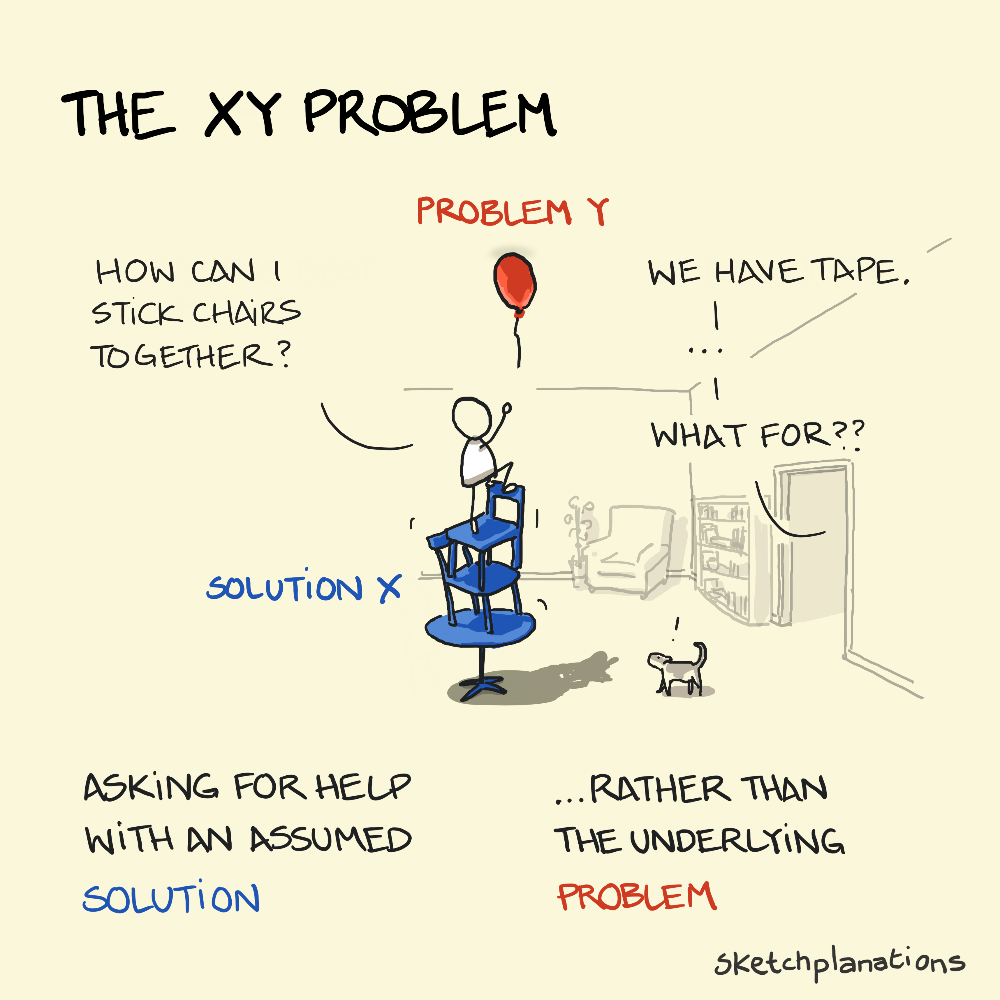
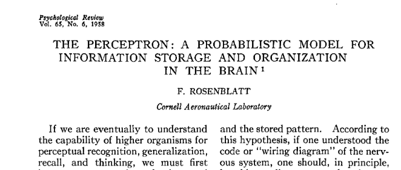
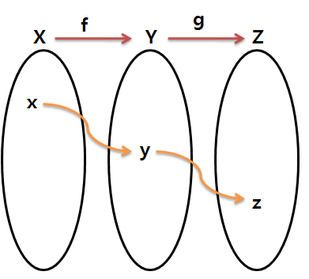

## 좋은 개발자란 무엇인가?

> 여러분의 개발 철학, 과정이 궁금해서 가져온 나의 개발 철학

_주의: 출처 없는 독자연구입니다._

2025/08/13 구효민.

---

여러분은 개발자로써의 삶을 선택하셨습니다.

---

---

---

좋은 개발자란 무엇인가?

---

좋은 프로그래머 === 좋은 프로그램을 만드는 사람

---

좋은 프로그램?

---

프로그램 === 문제를 해결해주는 논리적 기계

---

- 어떻게 해야 좋은 개발자가 될 수 있나요
- = 어떻게 해야 좋은 프로그램을 만들 수 있나요
- = 어떻게 해야 문제를 해결해주는 좋은 논리적 기계를 만들 수 있나요
- = **문제가 뭔데요?**

---

## Defining problems

> 문제에 따라 해답은 달라진다

---

클린 코드는 실존하나요?

---

### 어떤 곳에선...

- 한번 쓰고 버릴 코드를 1초라도 빨리 만들어야 합니다
- 동작 자체는 복잡하지 않지만, 단 한번의 오류라도 발생하면 지구가 멸망합니다
- 요구사항이 너무나도 복잡해서 수만개의 분기가 생기고, 이를 다 구현해야 합니다

=> 이 경우를 다 통합하는 "클린 코드"란 존재하나요?

---

- 한번 쓰고 버릴 코드를 1초라도 빨리 만들어야 합니다
  - **Python, 동적 타이핑, 스크립팅**: 빠르게 뭔갈 만들고 그냥 돌아가기만 하면 돼요
- 동작 자체는 복잡하지 않지만, 단 한번의 오류라도 발생하면 지구가 멸망합니다
  - **Haskell, OCaml 등의 함수형 언어, 엄격한 정적 타입**: 연역적 논리로 절대 버그가 발생하지 않아요(적어도 버그가 발생하지 않는다고 보장된 부분은)
- 요구사항이 너무나도 복잡해서 수만개의 분기가 생기고, 이를 다 구현해야 합니다
  - **수많은 라이브러리 생태계**: 복잡성을 내 눈앞에서 감춤으로써 실제 구현 코드는 단순화해요

=> 다양한 도구들은 다 각자의 Underlying problem을 해결하기 위해 등장한 것

---

### XY problem

문제 정의를 어떻게 하느냐에 따라 해결책은 천차만별

---

### What if we don't address UNDERLYING PROBLEM?

- EC2 서버비가 너무 많이 나와요
  - 하수: EC2 사양을 잘 맞춰서 비용을 줄인다
  - 고수: EC2 가 진짜 필요한가? 부터 생각한다 (SSG, Serverless)
- 랜딩 페이지의 디자인, 라이팅 수정이 필요해요
  - 하수: 그 앱의 랜딩 페이지를 수정해 준다
  - 고수: 랜딩 페이지를 수정하는 페이지 빌더를 제작한다 (CMS)

=> 문제의 본질을 보면 폭발적인 생산성 향상을 할 수 있음

---

## Ever-changing reality

> 변화하는 세상 속에서 살아남기

---

### 문제가 잘못 정의되었을 가능성이 높은 부분 / 낮은 부분을 나눠서 생각하기

- 유어슈의 수많은 서비스들... 아래에 있는 rusaint
- 바뀌지 않을 부분은 견고하게, 많이 바뀔 수 있는 부분은 빠르게

---

문제를 잘 쪼개는 것 만으로도 엄청난 시간을 줄일 수 있다

**커밋 하나로 다 구현하기 vs 커밋 잘 쪼개면서 개발하기**

`git reset/revert`(Undo)가 없는 삶... 상상할 수 있겠어요?

---

### 켄트 벡: Red-Green-Refactor

- RED: 문제가 정의되었고, 구현이 필요함
- GREEN: 문제에 대한 해결책을 구현함
- REFACTOR: 해결책이 (일부)옮다는 것이 입증되어서, 생산성을 위해 더 견고한 구현이 필요함

기획/문제 정의 단에서 잘못되었을 경우 Refactor 단계까지 가지도 않음

살아남은 코드는 강한 코드다(강해져야 한다)

---

### 모든 프로그램을 피라미드처럼 생각하기

- 문제를 해결하기 위한 가장 기본적인 단계를 설계하고(변하지 않는 것), 견고하게 구현하기
- 문제 정의가 잘못될 가능성이 높아질수록, 간결하고 금방 대체할 수 있도록(생산성이 높도록) 구조화하기
  - 예: 플러그인 아키텍처

---

## New horizons

> 눈앞의 복잡한 문제를 간결하게 바꾸면, 새로운 생각의 지평이 열린다

---

### ChatGPT의 (아주) 기반 기술

무려 1950년대 논문

---

### 중세 시대로 시간여행을 하면, 나는 신이 될 수 있을까?

- 지금까지의 모든 발전은 과거의 지식이 축적되어 이루어진 것
- End-to-end로 한번에 갈 수 있다는 생각은 버리기
- 현대 시대의 모든 기술들은 과거의 모든 기술들의 합성 함수

우리가 만드는 모든 기능들도, 작고 간결한 함수가 합성된 결과라고 생각하기

---

### 새로운 라이브러리가 계속 나오는 이유

- React, Solid, Web Component, Temporal... JS 생태계에는 계속 새로운 무언가가 나옴
  - 대체 왜? 그만 만들면 안되나?
- 새로운 무언가가 나오는 이유는 새로운 무언가가 이전에 나왔기 때문
- React라는게 나왔네? reconcile 기반 reactivity... 흥미롭네?
  - 어프로치는 좋은데 Virtual DOM으로 인한 오버헤드가 심하네? 컴파일러로 어떻게 안되나? -> Preact, Solid, ... Signals
- 하위 레이어 문제의 복잡성을 내부로 숨김으로써, 상위 레이어에서는 복잡성이 줄어듬
  - 복잡성이 줄어들어서 문제가 간단해졌으니, 더 어려운 문제를 풀 수 있겠네?
- 지금의 AI도 수많은 분야의 문제 해결 -> 복잡성 해소 -> 문제 해결이라는 사이클의 결과

---

ㅋㅋ

---

## Exponentially faster

> 덧셈보다는 곱셈으로

---

당면한 문제를 곧바로 해결하기 보다는, 한 걸음 물러서서 바라보기

- 문제들의 패턴이 존재하는가? 공통 분모는 무엇인가?
- 그 공통 분모는 어디에서 오는가?
- 공통 분모를 매번 반복하지 않을 방법은 있는가?
- 반복하지 않도록 일반화 하는데 드는 비용이 반복하는 비용(미래의 비용까지)보다 작은가?

---

- 문제를 간결하게 만드는 연습을 많이 하면...
  - 어려운 문제도 쉽게 푼다
  - 쉬운 문제는 더 쉽게 푼다
  - 개인적으로는 프로그래머의 생산성 차이는 여기에서 온다고 생각

이걸 좁은 스코프에서 하는게 PS, 넓은 스코프에서 하는게 시스템 디자인이지 않을까?

AI 써보면 알겠듯이 넓고 깊은 맥락을 다룰수록 어려워진다, 아키텍트가 돈 많이 받는 이유

---

- 문제를 간결하게 만드는 방법은 다양하다
  - 단순히 XY 문제를 해결하는 것만으로도 가능할 수 있다
  - 복잡한 문제를 적절한 단계로 잘 쪼개는 것으로도 가능할 수 있다
  - 도메인적 측면에서의 맹점을 통해 설계의 복잡성을 해소할 수 있다
  - 복잡한 부분을 숨기는 일반적인 구현을 통해 거기서 파생되는 문제의 복잡성을 줄인다
  - 좋은 프랙티스를 알아놓으면 남이 닦아놓은 지름길로 갈 수 있다
  - **(비추)** 해결책을 타협한다 -> 성장에 도움이 안된다

---

Fin.

> 여러분의 개발 철학은 무엇인가요?
