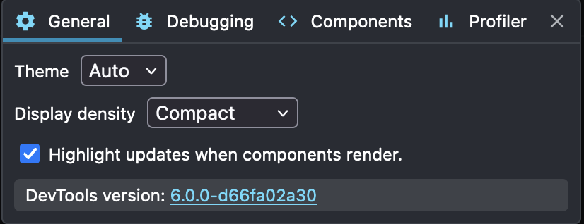
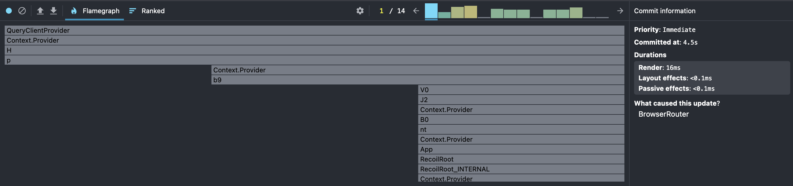
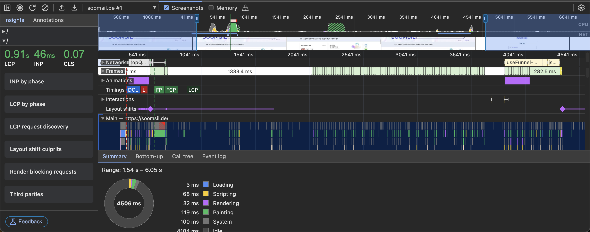
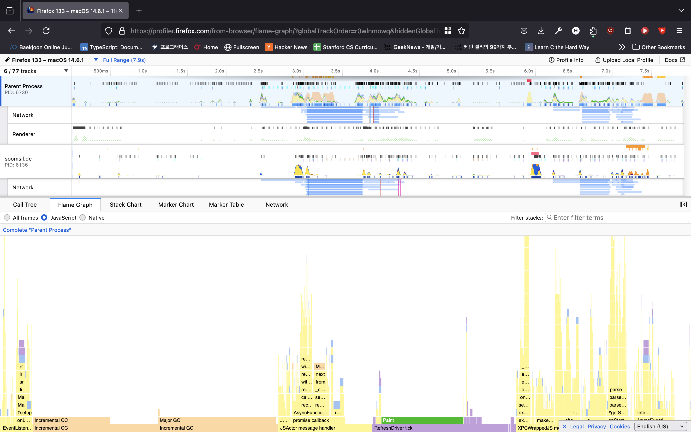
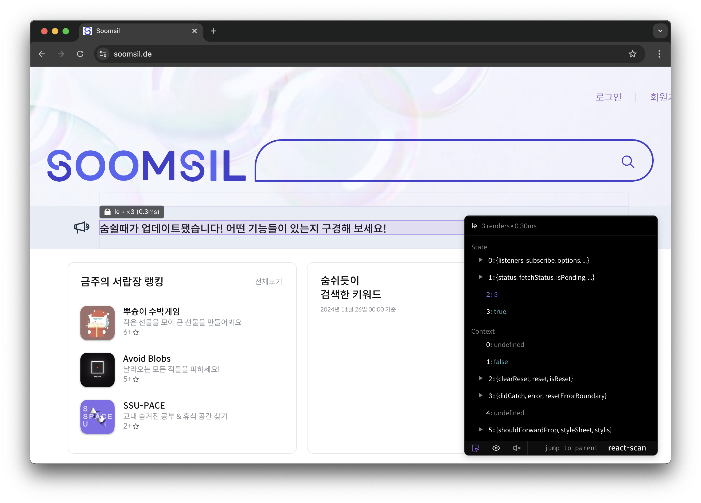
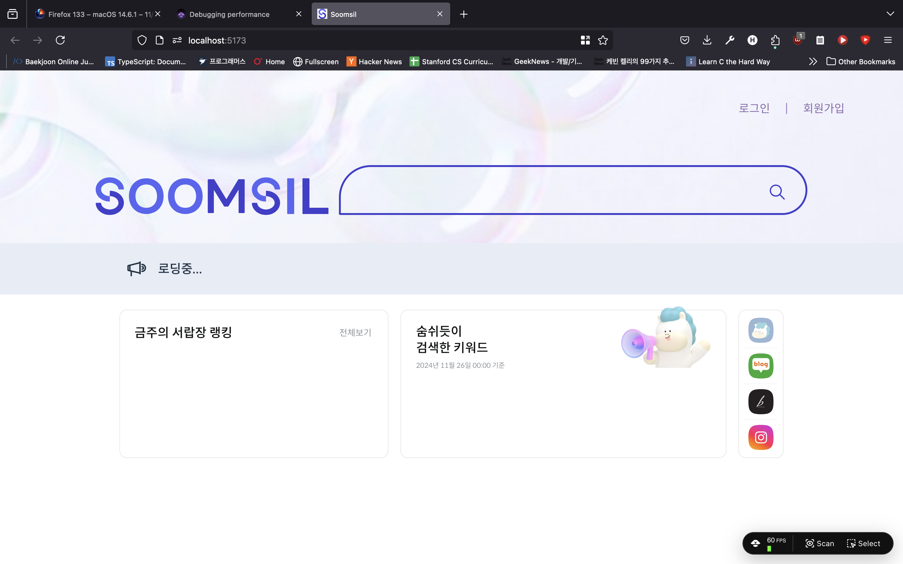
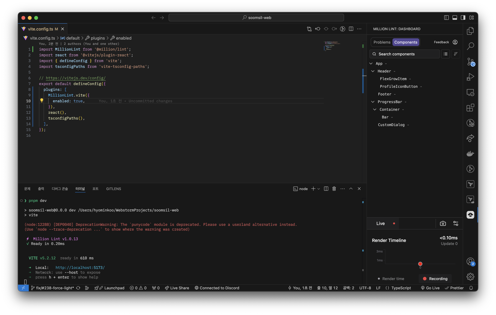

<!--
theme: default
-->

## React 앱 최적화

- 어렵다. 왜?
- 코드 작성 단계: 어떤 코드가 **리렌더링**을 발생시키는지 모름
  - 알아도 실수하면 급격한 성능 저하 발생

---

```typescript
useEffect(() => {
  someIntenseWork();
});
```

하나만 보면 모르지만 `useEffect`가 여러개 있는 코드에서 하나라도 이걸 빼먹는다면??

- 빼먹을수도 있지만 어떤 코드가 리렌더링을 발생시키는지 모르는 경우도 있음

---

## 1. React Anti-Patterns

---

> [!INFO] 안티 패턴
> 안티 패턴은 패턴의 반대, 따라야 하는 패턴이 아닌 **피해야 하는 패턴**

---

1. 컴포넌트 안에서 연산하기(inline computation)

```tsx
return <>
	{someArray.map((_, i) => <SomeButton key={i} onClick={() => handleClick(i)} />}
</>
```

어떻게 해야 할까?

---

**Answer. Curring**

```tsx
const clickHandler = (i) => () => handleClick(i);
return <>
	{someArray.map((_, i) => <SomeButton key={i} onClick={clickhandler(i)} />}
</>
```

---

2. 컴포넌트 안의 컴포넌트 안의 컴포넌트....

```tsx
export const WowComponent = () => {
  const BoldDivComponent = () => (
    <div className="text-bold">
      <span>Bolder!</span>
    </div>
  );

  return (
    <div>
      <BoldDivComponent />
    </div>
  );
};
```

---

**Answer. Extract**

```tsx
const BoldDivComponent = () => (
  <div className="text-bold">
    <span>Bolder!</span>
  </div>
);

export const WowComponent = () => {
  return (
    <div>
      <BoldDivComponent />
    </div>
  );
};
```

---

3. Next.js(or React 18) - 무지성 `"use client"`

```tsx
"use client";
export const HelloPage = () => {
  const someApi = await fetch("/api/dates").then((res) => await res.json());
  const clientFormatter = new Intl.DateTimeFormat();
  return (
    <>
      {someApi.map((date) => (
        <time>{clientFormatter.format(date)}</time>
      ))}
    </>
  );
};
```

---

**Answer. 서버에서 하면 좋은 작업과 클라이언트만 할 수 있는 작업을 분리**

```tsx
// page.tsx
export const HelloPage = () => {
  const someApi = await fetch("/api/dates").then((res) => await res.json());
  return <TimeList dates={someApi} />;
};

// TimeList.tsx
("use client");
export const TimeList = ({ dates }: { dates: string[] }) => {
  const clientFormatter = new Intl.DateTimeFormat();
  return (
    <>
      {dates.map((date) => (
        <time>{clientFormatter.format(date)}</time>
      ))}
    </>
  );
};
```

---

이외에도 좋은 안티패턴이 있으면 말해주세요~!
(useEffect empty deps 같은 너무 뻔한건 안넣음)

---

## 2. 성능 분석하기

---

- 코드를 작성할 때 아무리 고려하고 짰다고 해도 런타임에서 성능이 저하될 수 있음
- 성능 저하를 어떻게 알아낼 수 있을까?

---

### React Devtools

React 앱을 분석하기 위한 개발자 도구

---



**Flame graph: 스택 추적**


---

### 브라우저 Performance 탭

---

크롬 개발자 도구(131에서 야무지게 업데이트됨)



---

Firefox Profiler


---

### react-scan: 리렌더링 감시

```bash
pnpx react-scan@latest https://soomsil.de
```

---

프로덕션 환경에서도 감시할 수 있는 장점이 있음


---

### Million Lint: react-scan의 진화

```bash
pnpx million@latest
```

---



---


