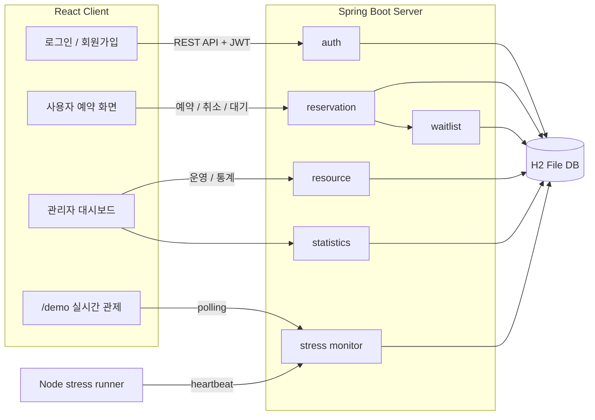
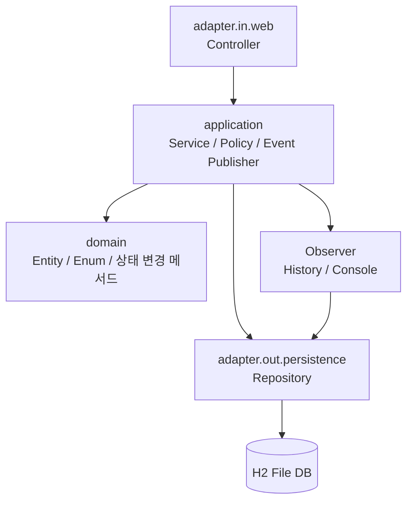
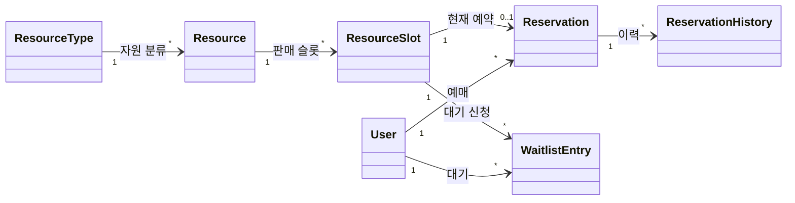
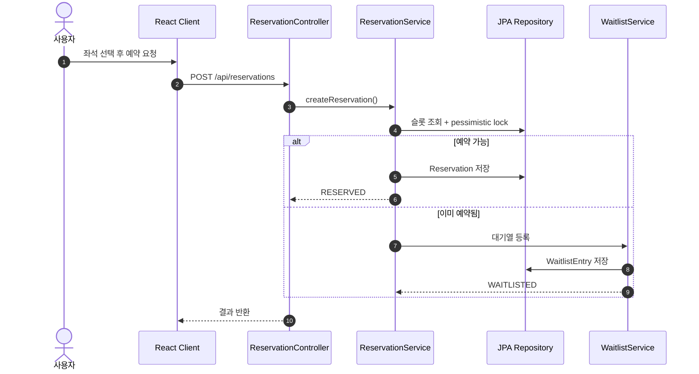
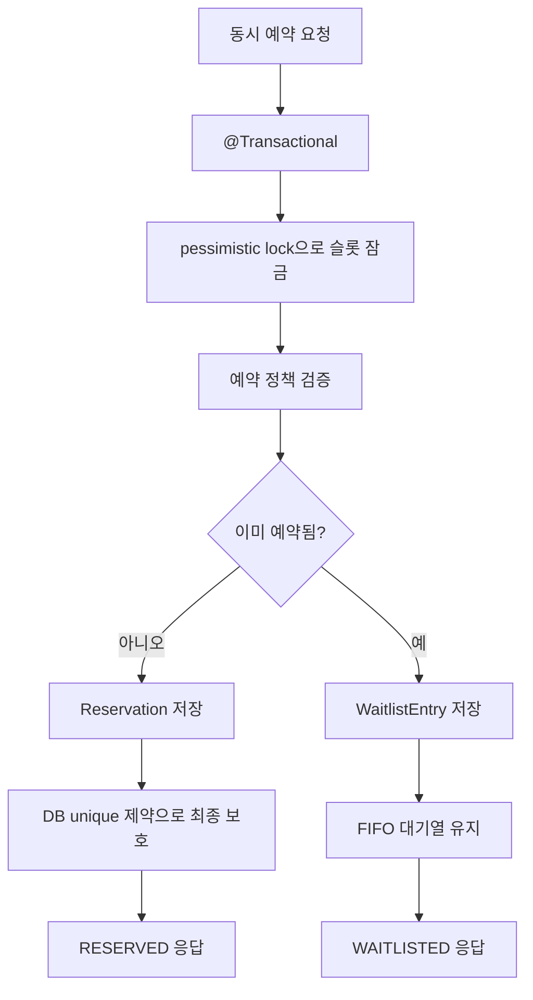
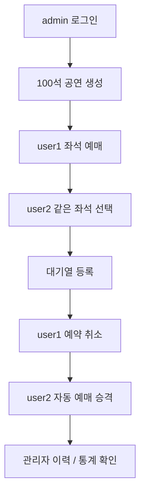

<!--
theme: default
-->

## 리소스 예약 관리 시스템

Spring Boot 기반 예약 서비스와 100석 티켓팅 데모

> 20211561 구효민 / 고급자바프로그래밍 발표

<!--
발표 메모:
안녕하세요. 이번 발표에서는 리소스 예약 관리 시스템 프로젝트를 소개하겠습니다.
이 프로젝트는 회의실, 좌석, 장비 같은 자원을 예약하는 기능을 구현하고, 이를 100석 티켓팅 시나리오로 시연할 수 있게 만든 Spring Boot 기반 프로젝트입니다.
-->

---

## 발표 개요

1. 프로젝트 소개
2. 시스템 구조
3. 구현 기능 설명
4. 주요 기술 적용 설명
5. 데모 시연 흐름
6. 개선 사항과 느낀 점

<!--
발표 메모:
발표는 권장 구성에 맞춰 여섯 부분으로 진행하겠습니다.
먼저 어떤 문제를 해결하려 했는지 설명하고, 백엔드와 프런트엔드 구조, 구현 기능, 적용 기술, 데모 순서, 마지막으로 개선점과 느낀 점을 말씀드리겠습니다.
-->

---

## 1. 프로젝트 소개

리소스 예약 관리 시스템은 여러 종류의 자원을 예약할 수 있는 REST API 서버입니다.

- 회의실, 좌석, 장비 같은 자원 예약
- 관리자와 일반 사용자 역할 분리
- 예약 생성, 취소, 이력, 통계 관리
- 100석 공연 티켓팅 데모로 실제 사용 흐름 재현

<!--
발표 메모:
프로젝트의 기본 도메인은 리소스 예약입니다.
사용자는 로그인 후 예약 가능한 시간대를 조회하고 예약하거나 취소할 수 있습니다.
관리자는 자원 종류와 자원, 예약 가능 시간대를 만들고 전체 예약 현황과 통계를 확인할 수 있습니다.
프런트엔드에서는 이 구조를 공연 티켓팅 사이트처럼 사용할 수 있도록 100석 예매 데모를 추가했습니다.
-->

---

## 문제 정의

예약 시스템에서 가장 중요한 문제는 **동시 예약 충돌**입니다.

- 여러 사용자가 같은 자원과 시간대를 동시에 선택
- 단순 CRUD만으로는 중복 예약이 생길 수 있음
- 매진된 좌석을 선택한 사용자를 어떻게 처리할지도 필요
- 관리자에게 운영 현황과 감사 이력을 보여줘야 함

<!--
발표 메모:
이 프로젝트에서 가장 중요하게 본 문제는 동시에 같은 좌석이나 같은 시간대를 예약하려는 상황입니다.
실제 티켓팅 서비스에서는 여러 사용자가 같은 좌석을 누를 수 있기 때문에 서버가 데이터 무결성을 지켜야 합니다.
또 이미 예약된 좌석이라면 단순 실패가 아니라 대기열 등록 흐름으로 자연스럽게 이어지도록 설계했습니다.
-->

---

## 프로젝트 목적

기능 구현과 함께 자바 백엔드 핵심 개념을 종합적으로 적용하는 것이 목표였습니다.

- 객체지향 도메인 모델링
- 계층 분리와 헥사고날 스타일 구조
- 인증과 인가
- 트랜잭션과 데이터 무결성
- 예약 정책, 이벤트, 통계, 대기열 구현

<!--
발표 메모:
단순히 화면에서 예약 버튼이 동작하는 것보다, 백엔드 안에서 역할이 잘 나뉘고 확장 가능한 구조를 만드는 데 집중했습니다.
그래서 domain, application, adapter 계층을 나누고, 정책이나 이벤트 처리처럼 바뀔 수 있는 부분은 인터페이스와 구현체로 분리했습니다.
-->

---

## 2. 시스템 구조



<!--
발표 메모:
전체 구조는 React 클라이언트, Spring Boot 서버, H2 파일 데이터베이스로 구성됩니다.
다이어그램에서 보듯 프런트엔드는 로그인, 사용자 예약, 관리자 대시보드, demo 화면으로 나뉘고, 각 화면은 REST API로 서버 모듈을 호출합니다.
서버는 인증, 자원, 예약, 대기열, 통계, stress 모니터링 영역으로 분리되어 있으며 데이터는 JPA를 통해 H2 파일 DB에 저장됩니다.
-->

---

## 백엔드 계층 구조



- HTTP 입구, 비즈니스 흐름, DB 접근, 도메인 규칙을 분리
- 이벤트 처리는 Observer로 분리해 확장 가능하게 구성

<!--
발표 메모:
백엔드는 계층을 분리했습니다.
Controller는 REST API 입구 역할만 하고, 실제 비즈니스 규칙은 Service에 둡니다.
Service는 도메인 객체의 상태 변경 메서드를 사용하고, 저장이 필요하면 Repository를 통해 DB에 접근합니다.
예약 이력 저장이나 콘솔 출력은 Observer로 분리해서 예약 서비스가 부가 기능에 직접 의존하지 않도록 했습니다.
-->

---

## 티켓팅 데모 도메인 매핑

기존 예약 도메인을 공연 티켓팅으로 해석했습니다.

| 예약 시스템     | 티켓팅 데모                     |
| --------------- | ------------------------------- |
| `ResourceType`  | 공연                            |
| `Resource`      | 좌석                            |
| `ResourceSlot`  | 특정 공연 시간의 좌석 판매 슬롯 |
| `Reservation`   | 예매 티켓                       |
| `WaitlistEntry` | 매진 좌석 대기 신청             |

<!--
발표 메모:
기존 시스템은 회의실이나 장비 같은 범용 리소스 예약을 지원합니다.
데모에서는 이 구조를 공연 티켓팅으로 매핑했습니다.
예를 들어 ResourceType은 공연, Resource는 좌석, ResourceSlot은 특정 공연 시간의 좌석 판매 슬롯이 됩니다.
덕분에 같은 백엔드 구조를 더 직관적인 티켓팅 시나리오로 보여줄 수 있습니다.
-->

---

## 도메인 관계도



<!--
발표 메모:
도메인 관계를 보면 공연 또는 자원 종류 아래에 실제 좌석이나 자원이 있고, 각 자원에는 예약 가능한 슬롯이 연결됩니다.
사용자는 슬롯에 대해 예약을 만들 수 있고, 이미 예약된 슬롯에는 대기열 항목이 쌓입니다.
예약 생성, 취소, 대기 승격은 ReservationHistory로 남겨 관리자 화면에서 감사 이력처럼 확인할 수 있습니다.
-->

---

## 3. 구현 기능: 인증과 권한

- 회원가입: `POST /api/auth/signup`
- 로그인: `POST /api/auth/login`
- JWT 기반 인증 처리
- `ADMIN`, `USER` 역할에 따른 API 접근 제어
- 초기 관리자와 사용자 계정 자동 생성

<!--
발표 메모:
인증은 JWT 기반으로 구현했습니다.
사용자는 회원가입과 로그인을 통해 토큰을 발급받고, 보호된 API는 Authorization 헤더에 Bearer 토큰을 포함해서 호출합니다.
또 관리자와 일반 사용자 역할을 나눠서 관리자 API는 ADMIN 권한이 있을 때만 접근할 수 있도록 했습니다.
-->

---

## 구현 기능: 관리자

관리자는 예약 서비스를 운영하는 역할입니다.

- 자원 종류 생성과 조회
- 자원 생성, 수정, 비활성화
- 예약 가능 시간대 생성과 비활성화
- 전체 예약 목록과 예약 이력 조회
- 예약 통계 확인
- 100석 공연과 좌석 일괄 생성

<!--
발표 메모:
관리자 화면에서는 예약 서비스 운영에 필요한 기능을 제공합니다.
일반 예약 시스템 관점에서는 자원과 시간대를 관리하고, 티켓팅 데모 관점에서는 공연 하나와 좌석 100개를 한 번에 생성할 수 있습니다.
또 전체 예매 현황, 대기열, 예약 이력, 통계를 한 화면에서 볼 수 있습니다.
-->

---

## 구현 기능: 사용자

사용자는 실제 예약 또는 예매를 수행합니다.

- 예약 가능한 자원 시간대 조회
- 예약 생성
- 내 예약 목록 조회
- 예약 취소
- 매진 좌석 대기열 등록
- 대기 취소와 자동 승격 결과 확인

<!--
발표 메모:
사용자 화면에서는 예약 가능한 시간대나 좌석을 보고 예약할 수 있습니다.
이미 예약된 좌석을 다른 사용자가 선택하면 대기열 등록으로 이어지고, 기존 예약자가 취소하면 가장 먼저 기다린 사용자가 자동으로 예매 승격됩니다.
-->

---

## 구현 기능: 이벤트와 통계

- 예약 생성, 취소, 대기 승격 이벤트 발행
- 예약 이력 저장
- 콘솔 로그 Observer 출력
- 전체 슬롯 수와 예약된 슬롯 수 집계
- 예약률, 자원 유형별 예약 수, 사용자별 활성 예약 수 계산

<!--
발표 메모:
예약이 생성되거나 취소될 때 이벤트를 발행하고, 이를 Observer가 받아서 예약 이력으로 저장합니다.
이 구조를 사용하면 나중에 알림이나 외부 로그 전송 기능을 추가할 때도 이벤트 구독자를 더하는 방식으로 확장할 수 있습니다.
통계 기능은 관리자 화면에서 전체 운영 상태를 빠르게 확인하는 데 사용됩니다.
-->

---

## 4. 주요 기술: 객체지향 설계

도메인을 역할별 클래스로 나누고 상태 변경을 캡슐화했습니다.

- `User`, `Role`
- `ResourceType`, `Resource`, `ResourceSlot`
- `Reservation`, `ReservationStatus`
- `WaitlistEntry`
- `ReservationPolicy`, `ReservationObserver`

<!--
발표 메모:
객체지향 설계에서는 도메인 모델을 명확히 나누는 데 집중했습니다.
예약, 자원, 시간대, 대기열은 각각 별도의 클래스로 관리하고, 취소나 승격처럼 상태가 바뀌는 동작은 객체의 메서드로 표현했습니다.
이렇게 하면 상태 변경 규칙이 여러 곳에 흩어지지 않고 도메인 내부에 모이게 됩니다.
-->

---

## 주요 기술: 디자인 패턴

- **Strategy 패턴**
  - `DailyLimitPolicy`
  - `ActiveTotalLimitPolicy`
- **Factory 패턴**
  - `ReservationPolicyFactory`가 정책 선택
- **Observer 패턴**
  - `ReservationEventPublisher`가 이벤트 전달
  - 이력 저장, 콘솔 출력 Observer 분리

<!--
발표 메모:
예약 정책은 Strategy 패턴으로 분리했습니다.
하루 예약 제한이나 활성 예약 총량 제한처럼 정책이 달라질 수 있는 부분을 구현체로 나눴습니다.
그리고 Factory가 자원 유형에 맞는 정책을 선택합니다.
예약 이벤트는 Observer 패턴으로 처리해서 이력 저장과 콘솔 출력이 예약 서비스와 강하게 결합되지 않게 했습니다.
-->

---

## 예약 생성과 대기열 흐름



<!--
발표 메모:
예약 요청 흐름은 이렇게 진행됩니다.
사용자가 좌석을 선택하면 클라이언트가 예약 API를 호출하고, ReservationService는 슬롯을 잠근 상태에서 예약 가능 여부를 판단합니다.
예약 가능하면 Reservation을 저장하고, 이미 예약된 슬롯이면 WaitlistService를 통해 대기열 항목을 저장합니다.
-->

---

## 주요 기술: 동시성 제어



하나의 성공 경로와 대기열 경로를 명확히 분리했습니다.

<!--
발표 메모:
동시성 제어는 이 프로젝트의 핵심입니다.
여러 사용자가 같은 좌석을 동시에 예약해도 하나의 예약만 성공해야 합니다.
이를 위해 트랜잭션 안에서 슬롯을 잠그고 예약 정책을 검증한 뒤, 예약 가능하면 Reservation을 저장합니다.
이미 예약된 슬롯이면 대기열로 이동하고, 마지막 방어선으로 DB unique 제약을 둬 데이터 무결성을 보장했습니다.
-->

---

## 주요 기술: DB 연동

- Spring Data JPA 기반 Repository 사용
- H2 file DB 사용
- 예약, 대기열, 이력 데이터를 Entity로 저장
- Repository 집계 쿼리로 통계 계산
- H2 Console로 데이터 확인 가능

```text
JDBC URL: jdbc:h2:file:./data/resource-reservation-db
```

<!--
발표 메모:
DB 연동은 Spring Data JPA를 사용했습니다.
예약, 대기열, 예약 이력 같은 데이터는 JPA Entity로 저장됩니다.
개발과 시연 환경에서는 H2 file DB를 사용해서 서버를 다시 실행해도 데이터를 유지할 수 있게 했고, H2 Console로 직접 데이터를 확인할 수 있습니다.
-->

---

## 주요 기술: REST API

프런트엔드와 백엔드는 REST API로 통신합니다.

| 기능         | API                                        |
| ------------ | ------------------------------------------ |
| 로그인       | `POST /api/auth/login`                     |
| 예약 생성    | `POST /api/reservations`                   |
| 내 예약 조회 | `GET /api/reservations/me`                 |
| 예약 취소    | `DELETE /api/reservations/{reservationId}` |
| 관리자 통계  | `GET /api/admin/statistics/reservations`   |

<!--
발표 메모:
서버 기능은 REST API로 제공합니다.
프런트엔드는 공통 API 호출 함수를 통해 토큰을 포함하고, 응답과 오류를 처리합니다.
Swagger UI도 제공해서 API 목록과 요청 형식을 확인할 수 있습니다.
-->

---

## 주요 기술: 벤치마크와 Stress Demo

동시성 동작을 설명하기 위해 세 가지 관측 흐름을 분리했습니다.

- 서비스 레벨 벤치마크
  - `baseline-conflict`
  - `waitlist-contention`
  - `cancel-promote`
- 브라우저 `/demo` 실시간 시뮬레이션
- 외부 Node stress runner

<!--
발표 메모:
동시성 기능은 실제로 관측하기 어렵기 때문에 벤치마크와 데모를 분리했습니다.
서비스 레벨 벤치마크는 Spring 통합 테스트에서 트랜잭션과 대기열 동작을 확인합니다.
브라우저 demo는 사용자가 보기 쉬운 실시간 흐름을 보여주고, 외부 stress runner는 더 많은 synthetic user 시나리오를 서버에 보고합니다.
이 세 가지는 목적이 다르기 때문에 수치를 직접 비교하지는 않습니다.
-->

---

## 5. 데모 시연 흐름



핵심 장면은 **대기열 등록 → 취소 → 자동 승격**입니다.

<!--
발표 메모:
시연은 관리자에서 공연을 열고, user1이 먼저 좌석을 예매한 뒤, user2가 같은 좌석에 대기열을 등록하는 순서로 진행합니다.
그 다음 user1이 예약을 취소하면 user2가 자동으로 예매 승격됩니다.
마지막으로 관리자 화면에서 예매 이력과 통계가 갱신되는 것을 확인합니다.
영상에서는 특히 대기열 등록, 취소, 자동 승격 장면을 핵심으로 보여주면 됩니다.
-->

---

## `/demo` 실시간 관제 화면

`/demo`에서는 작은 티켓팅 시나리오를 한 화면에서 재생합니다.

- 카운트다운
- 입장 완료
- 동시 클릭
- 대기열 정착
- 취소 후 승격 확인
- `reserved`, `waitlisted`, `conflicts`, `p95 latency` 관측

<!--
발표 메모:
별도 demo 화면은 영상 발표에서 핵심 장면을 보여주기 좋습니다.
카운트다운 이후 여러 요청이 동시에 들어오는 것처럼 재생하고, 예약 성공, 대기열, 충돌, 지연 시간 같은 값을 함께 확인할 수 있습니다.
또 서버의 관리자 API polling 결과와 외부 stress runner 상태도 구분해서 보여줍니다.
-->

---

## 6. 개선 사항

- 운영 DB 기준 성능 측정 추가
- Redis나 메시지 큐를 활용한 분산 환경 대응
- 예약 알림 기능 추가
- 관리자 통계 시각화 강화
- 프런트엔드 오류 피드백과 접근성 개선
- 테스트와 벤치마크 시나리오 확대

<!--
발표 메모:
개선 사항으로는 먼저 H2 기반 로컬 측정을 넘어 운영 DB 기준의 성능 측정을 해볼 수 있습니다.
트래픽이 더 큰 환경에서는 Redis나 메시지 큐를 활용해 분산 환경에 대응할 수도 있습니다.
또 사용자에게 예약 성공, 대기열 승격, 취소 알림을 보내는 기능을 추가하면 실제 서비스에 더 가까워질 것입니다.
-->

---

## 느낀 점

- 예약 시스템은 단순 CRUD보다 동시성과 무결성이 중요했습니다.
- 도메인과 계층을 분리하니 기능 확장이 쉬워졌습니다.
- 대기열과 자동 승격을 구현하면서 실제 서비스 흐름을 더 잘 이해했습니다.
- 벤치마크와 데모를 분리하니 검증과 시연 목적이 명확해졌습니다.

<!--
발표 메모:
이번 프로젝트를 하면서 예약 시스템은 화면에서 버튼을 누르는 단순 기능보다 서버가 동시에 들어오는 요청을 어떻게 안전하게 처리하는지가 더 중요하다는 것을 느꼈습니다.
또 객체지향적으로 도메인을 나누고 계층을 분리해 두면, 대기열이나 통계 같은 기능을 추가할 때 구조를 유지하기 쉽다는 점을 배웠습니다.
-->

---

감사합니다.

<!--
발표 메모:
정리하면 이 프로젝트는 예약 서비스의 기본 기능뿐 아니라 동시성 제어, 대기열, 자동 승격, 통계, 관리자 화면까지 구현한 프로젝트입니다.
이상으로 발표를 마치겠습니다. 감사합니다.
-->
