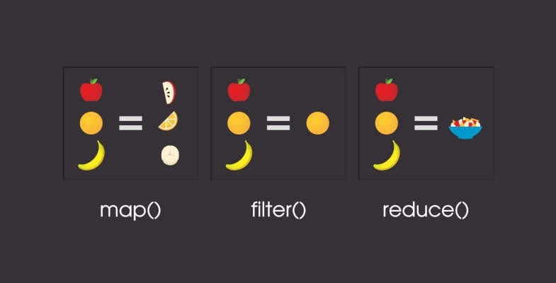
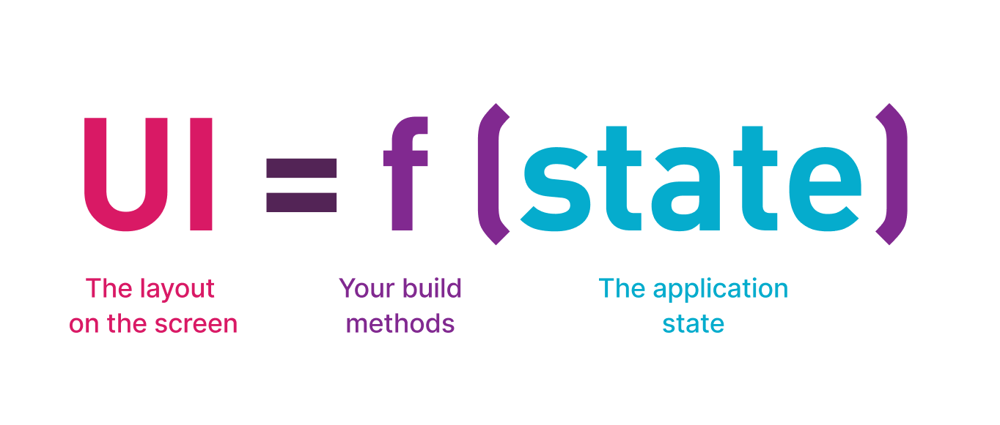
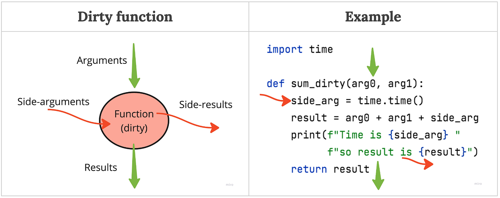
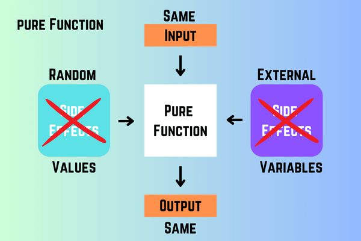

<!--
theme: default
-->

## Why Functional Thinking?

> Introduction to Functional Thinking (Programming) for React Developers  
> 함수형 사고는 왜 필요한가?: 리액트 개발자를 위한 함수형 사고(프로그래밍) 입문

2026/03/30 구효민.

---

## I Heard about "Functional Programming"


> 나는 함수형 컴포넌트를 써 봤어요!

---


map, filter, reduce?

---


Monad? (함수형 프로그래밍을 들어본 적이 있다면)

---

## Program as a Function

프로그램은 무엇일까요?

- Imperative Programming의 관점: 무언가를 처리하는 과정을 기술한 문장(statements)의 순열
- Functional Programming의 관점: 무언가를 입력하면 무엇을 출력하는 **함수**

---

프로그램을 하나의 합성 함수로 정의한다면, 우리가 생각하는 문제 정의/해결책과 프로그램 코드의 멘탈 모델이 일치될 수 있음

```

프로그램 (복잡한 문제를 처리하는 함수)
ㄴ 내부 모듈 (복잡한 문제를 쪼갠 하위 문제를 처리하는 함수)
ㄴ 내부 함수 (하위 문제를 또 쪼갠...)
ㄴ 라이브러리 코드 (내부는 복잡하지만 입력과 출력이 명확하여 이 문제에서 깊게 들여다 볼 필요가 없는 함수)

```

---



- 결국 UI는 다양한 상태를 잘 보여주는(transform) 하는 것
  - 선언형 UI 패턴(React, Vue, Jetpack Compose 등)
- 결국 정확한 좌표나 크기보다 컨텐츠들이 어떤 방식으로 표기되는 의도가 중요한 것이 아닌가?

---

## Side-effects: Reality Is Not Always Ideal



---

- 수학의 세계에서는 모든 함수들이 순수 함수 (닫힌 함수)이지만 현실 세계에서는 그렇지 않음
  - I/O interrupt, 하드웨어 오류, 네트워크... 등등
- 컴퓨터 세계에서 쌓아진 모든 레이어들이 완벽하게 동작하지 않을 가능성
- 컴퓨터 구조에 따라 컴퓨터 내부의 상태를 직접 변경하는 것이 효율적일 가능성
  - 결국 컴퓨터는 state machine

---

## Purity: We Need More Safe Areas



- 순수 함수는 외부 환경에 영향을 받지 않는 함수
- 현실의 특성 상 프로그램의 모든 부분이 순수하기는 매우 어렵지만, 순수 함수의 영역이 넓어질수록 프로그램의 예측 가능성은 증가함

---

- **순수 함수로 작성하면...**
  - 프로그램을 실행하지 않아도 결과를 알 수 있다 (??)
    - 전제: 입력과 출력에 대한 제약을 정확하게 정의하기
  - 정적 분석(타입 시스템 등)의 도움을 많이 받을 수 있다
  - 내가 기존 함수를 사용할 때 두려워 할 필요가 없다

---

## FP in React: We Are Already Using It

- React는 왜 함수형 컴포넌트로 전환했는가?
  - Composable: UI 컴포넌트를 합성 함수로 보기
  - `useMemo`의 전제: 순수 함수여야 함!
  - `useEffect`와 Strict mode
    - 왜 useEffect의 이름이 useEffect인가? 왜 개발 환경에서 두번 실행되는가?
  - `useReducer`: 불변성, 순수성
  - HOC(Higher-order components)

---

## Why React Best Practices Feel Functional

- 함수형 프로그래밍의 극의: 언제 어디서 실행하든 **입력이 같으면 출력은 같다**
- 리액트의 모든 BP는 이를 보장하면서, 좋은 composition을 통해 나의 컴포넌트(함수)가 원하는 입력과 출력만 갖도록 하는 것

---

### Bad

```tsx
const NoCompose = (props: SomeLargeProps) => (
  <article>
    <section id="a-sec">
      <p>{props.a.wow}</p>
      {/* ... */}
    </section>
    <section id="b-sec">
      <p>{props.b.what}</p>
      {/* ... */}
    </section>
  </article>
);
```

---

### Good

```tsx
const ASection = (props: ASectionProps) => (
  <section id="a-sec">{/* ... */}</section>
);

const BSection = (props: BSectionProps) => (
  <section id="b-sec">{/* ... */}</section>
);

const GoodCompose = (props: SomeLargeProps) => (
  <article>
    <ASection {...props.a} />
    <BSection {...props.b} />
  </article>
);
```

---

### Eventually

Before: `no_compose(a, b) -> view`
After: `compose(a_sec(a), b_sec(b)) -> view`

- 직관적으로 봐도 내부 섹션이 바뀌었을 때, Before는 no_compose 내부 로직을 전부 수정해야 함 -> 섹션간 경계 침범 위험 -> 스파게티
- 반면 함수 합성을 사용하면 내부 섹션이 바뀌어도 `compose` 함수는 남고, 다른 섹션의 함수 내부는 절대 변경되지 않음이 보장

---

- 함수의 순수성을 유지하면, 작은 단위로 쪼개고 조합하는 것이 쉬워짐
- 좋은 React 코드는 결국
  - state를 덜 저장하고
  - props를 더 명확하게 나누고
  - effect를 바깥으로 밀어내고
  - render를 더 순수하게 만드는 방향으로 감

- 즉 React Best Practice는 프레임워크의 취향이 아니라, 함수형 사고를 따를 때 자연스럽게 나오는 결과물

---

## Requirements Become Test Cases and Constraints

요구사항은 보통 긴 문장으로 시작하지만, 결국 코드로 옮길 때는 아래 두 가지로 수렴함

- **Test Cases**
  - 이 입력이 들어오면 이 출력이 나와야 한다

- **Constraints**
  - 어떤 상황에서도 반드시 지켜야 하는 규칙이 있다

---

장바구니 UI를 만든다면...

- **Test Case**
  - 상품이 0개면 empty view가 보여야 한다
  - 상품이 3개면 total count는 3이어야 한다
  - 할인 코드가 적용되면 total price가 다시 계산되어야 한다

- **Constraint**
  - total price는 item들의 합과 항상 일치해야 한다
  - 음수 가격은 보여주면 안 된다
  - 서버 응답이 늦어도 UI는 깨지면 안 된다

---

함수형 사고는 이런 요구사항을

- “어떤 함수가 어떤 입력을 받아 어떤 출력을 내야 하는가”
- "각각의 요소들을 어떤 함수로 쪼개고, 어떤 파이프라인으로 합성해야 하는가"
- “어떤 제약이 항상 유지되어야 하는가”

로 바꾸어 생각하게 만듦

---

## Pipelines for Changing Requirements

복잡한 요구사항은 보통 한 번에 해결되지 않음

- 서버 응답 형식이 바뀜
- 디자이너가 UI 조건을 바꿈
- 새로운 예외 케이스가 추가됨
- 정렬/필터/가공 규칙이 계속 늘어남

---

이때 거대한 함수 하나보다, 작은 변환 파이프라인이 더 강함

```ts
raw_data
  -> validate
  -> normalize
  -> derive_view_model
  -> render
```

---

파이프라인으로 나누면

- 어디서 무엇을 처리하는지 명확해짐
- test case를 단계별로 검증할 수 있음
- constraint를 어느 단계에서 지켜야 하는지 드러남
- 요구사항이 바뀌어도 전체를 뜯지 않고 일부 단계만 수정 가능

---

React에서도 비슷함

- API 응답을 그대로 렌더하지 않기
- 중간에 view model, hooks를 만들기
- render 함수는 최대한 “보여주기”에 집중하기
- effect는 마지막 동기화 단계로 밀어내기

---

## Functional Thinking Is the Real Goal

오늘 이야기한 핵심은 FP 문법 자체가 아님

- Monad를 몰라도 됨
- Functor를 몰라도 됨
- Haskell을 쓰지 않아도 됨

---

더 중요한 것은 이런 사고 방식

- 프로그램을 함수로 보기
- side-effect를 경계로 밀어내기
- 가능한 많은 safe area 만들기
- 요구사항을 test case와 constraint로 다루기
- 변화를 파이프라인으로 받기

---

React는 이 사고를 연습하기에 꽤 좋은 환경임

- UI를 함수처럼 다루고
- composition을 장려하고
- purity를 요구하고
- effect를 분리하게 만들기 때문

---

**결국 중요한 것은 FP가 아니라 Functional Thinking이다**

- 더 예측 가능하게
- 더 조합 가능하게
- 더 덜 무섭게 코드를 바꾸기 위해

---

EOD
